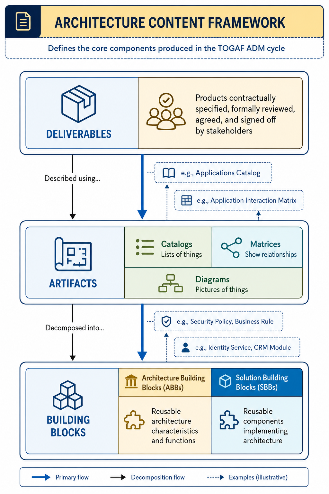
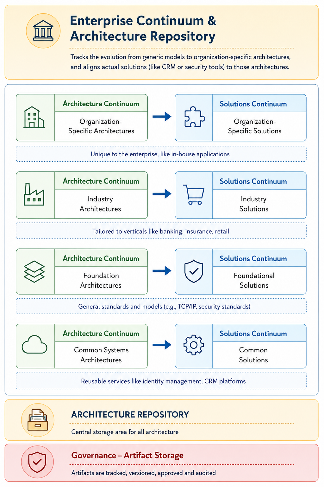
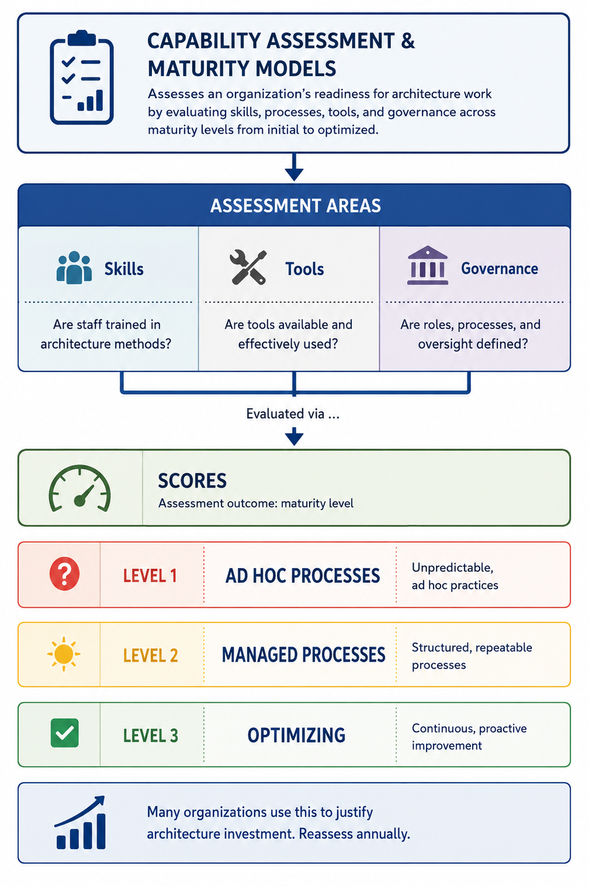
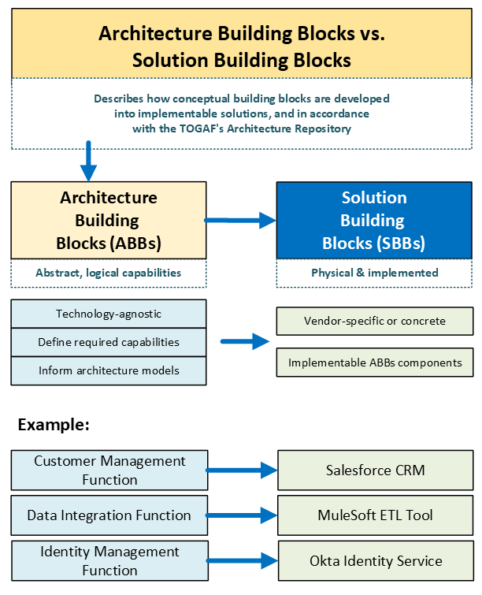

# TOGAF Diagrams

> A free visual library of TOGAF architecture concepts — clear, simplified diagrams covering the ADM cycle, content framework, governance model, and more.

## Repository structure

- `docs/diagrams/`: active, published diagram PNG files grouped by domain.
- `archive/`: superseded or historical diagram files.
- `README.md`: repository overview for GitHub.
- `index.md`: GitHub Pages landing page.

## Diagrams

### 1. TOGAF ADM End-to-End Reference Map

   
  <em>TOGAF ADM End-to-End Reference Map</em>

### 2. TOGAF ADM Cycle

   
  <em>TOGAF ADM Cycle — Previous version retained in the archive folder for traceability.</em>

### 3. Architecture Content Framework

   
  <em>Architecture Content Framework</em>

### 4. Enterprise Continuum & Architecture Repository

   
  <em>Enterprise Continuum & Architecture Repository</em>

### 5. Capability Assessment & Maturity Models

   
  <em>Capability Assessment & Maturity Models</em>

### 6. Stakeholder Map with Views & Concerns

   
  <em>Stakeholder Map with Views & Concerns</em>

### 7. Architecture Building Blocks vs. Solution Building Blocks

   
  <em>Architecture Building Blocks vs. Solution Building Blocks</em>

### 8. Architecture Governance Model

   
  <em>Architecture Governance Model</em>

## Contributing

See [CONTRIBUTING.md](CONTRIBUTING.md).

## License

This repository is licensed under the [MIT License](./LICENSE).
