# TOGAF Diagrams

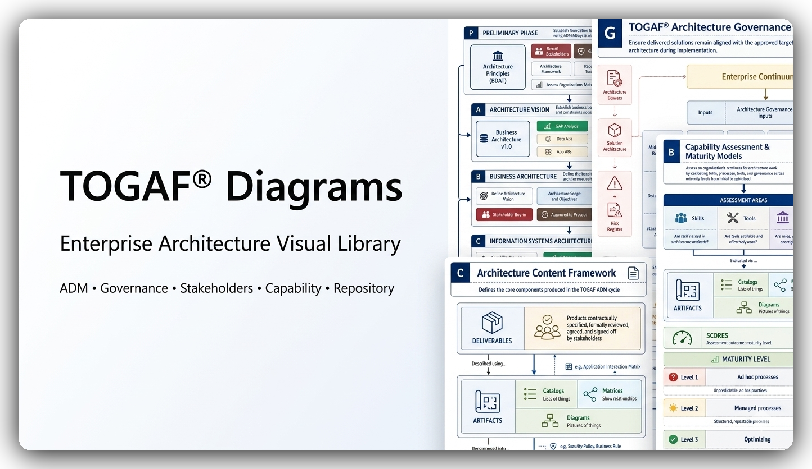

A free visual library of TOGAF architecture concepts, clear, simplified diagrams.

> All diagrams in this repository were created by me and are free to use under the MIT License.
> 
> They are free to use for any purpose, personal or commercial, with no attribution required, though it’s always appreciated.
> 
> If you find them useful, consider leaving a ⭐ it helps others find the library too.

## Repository structure

- `docs/images/`: repository presentation assets for GitHub-facing documentation.
- `docs/diagrams/`: active, published diagram PNG files grouped by domain.
- `archive/`: superseded or historical diagram files.
- `README.md`: repository overview for GitHub.
- `index.md`: GitHub Pages landing page.

## Diagrams

### 1. TOGAF ADM End-to-End Reference Map

A full reference view connecting all ADM phases with key inputs, outputs and inter-phase relationships in a map.

  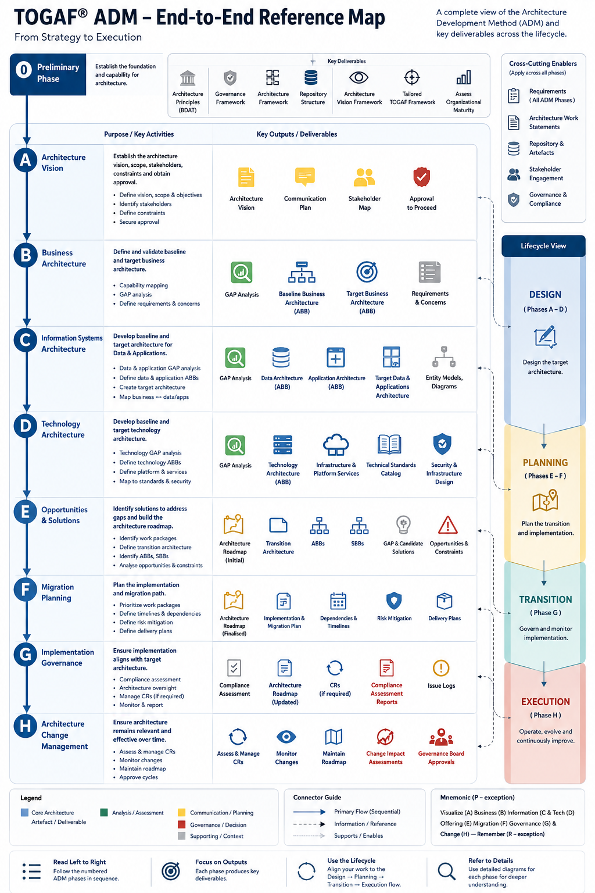 
  <em>TOGAF ADM End-to-End Reference Map</em>

### 2. TOGAF ADM Cycle

The iterative ADM cycle showing all architecture development phases organized around a central Requirements Management process.

  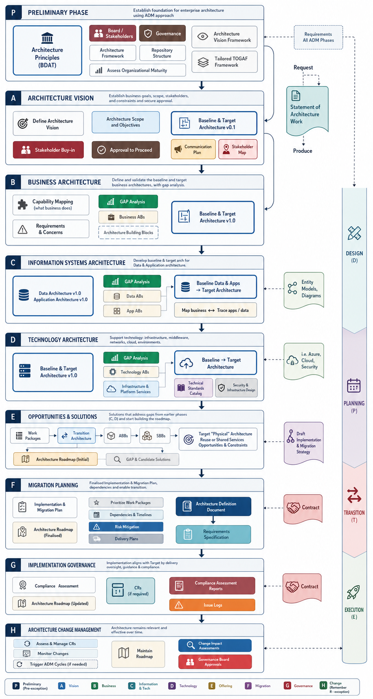 
  <em>TOGAF ADM Cycle — Previous version retained in the archive folder for traceability.</em>

<table>
<tr>
<td width="50%" valign="top">

### 3. Architecture Content Framework

A structured metamodel defining the types of architectural work products — deliverables, artifacts, and building blocks — produced across the ADM.

</td>
<td width="50%" valign="top">

### 4. Enterprise Continuum & Architecture Repository

A classification system for architecture assets ranging from generic foundation architectures to organization-specific solutions, stored in the Architecture Repository.

</td>
</tr>
<tr>
<td width="50%" align="center">
  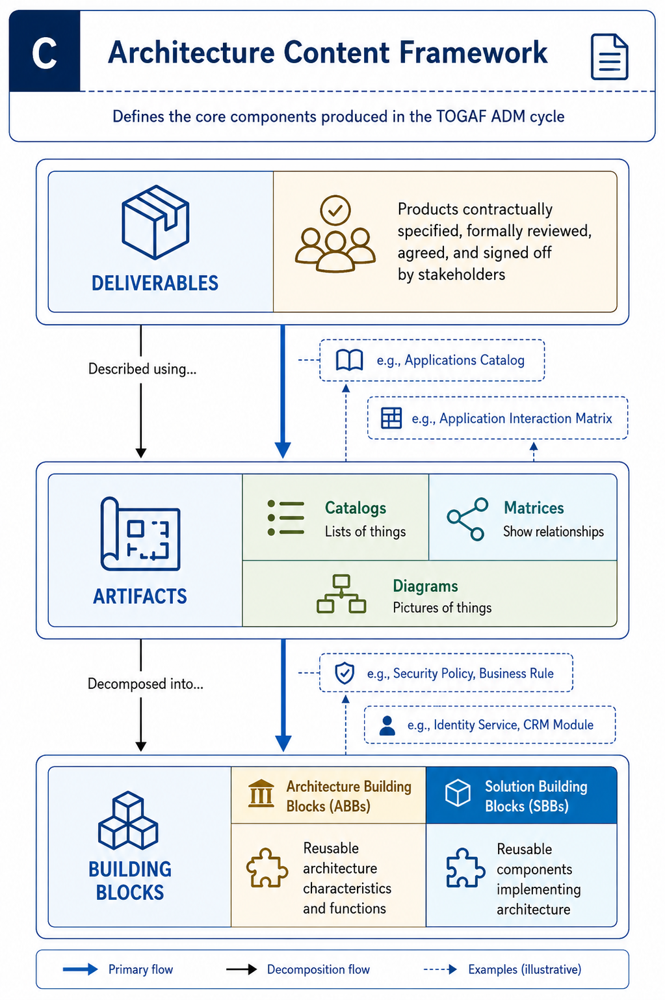 
  <em>Architecture Content Framework</em>
</td>
<td width="50%" align="center">
   
  <em>Enterprise Continuum & Architecture Repository</em>
</td>
</tr>
</table>

<table>
<tr>
<td width="50%" valign="top">

### 5. Capability Assessment & Maturity Models

A tool for evaluating the maturity of an organization's architecture capabilities across key dimensions using defined maturity levels.

</td>
<td width="50%" valign="top">

### 6. Architecture Building Blocks vs. Solution Building Blocks

A comparison of abstract, reusable architecture building blocks against concrete, vendor-specific solution building blocks.

</td>
</tr>
<tr>
<td width="50%" align="center">
  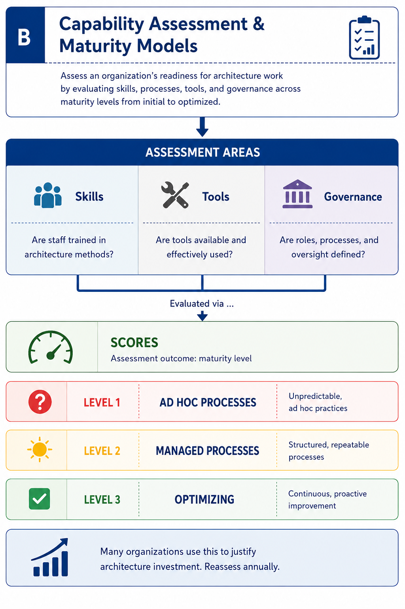 
  <em>Capability Assessment & Maturity Models</em>
</td>
<td width="50%" align="center" valign="top">
   
  <em>Architecture Building Blocks vs. Solution Building Blocks</em>
</td>
</tr>
</table>

<table>
<tr>
<td width="50%" valign="top">

### 7. Stakeholder Map with Views & Concerns

A mapping of key stakeholder roles to the architecture views and concerns most relevant to them, supporting targeted communication.

</td>
<td width="50%" valign="top">

### 8. Architecture Governance Model

An overview of the governance structures, oversight bodies, and accountability mechanisms that ensure architecture compliance and quality.

</td>
</tr>
<tr>
<td width="50%" align="center" valign="top">
  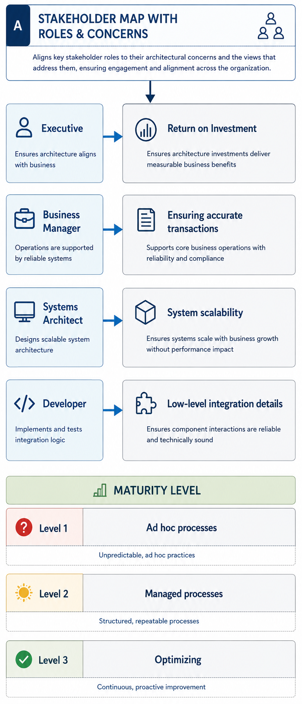 
  <em>Stakeholder Map with Views & Concerns</em>
</td>
<td width="50%" align="center" valign="top">
  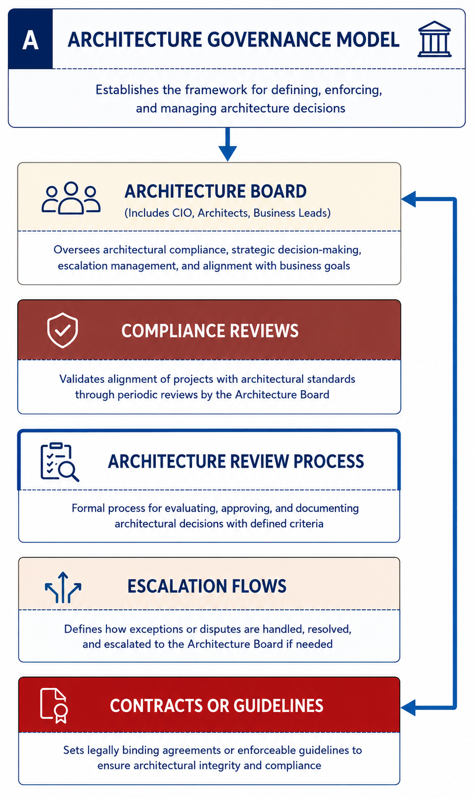 
  <em>Architecture Governance Model</em>
</td>
</tr>
</table>

<table>
<tr>
<td valign="top">

### 9. Business Scenarios

In Phase A (Architecture Vision), Business Scenarios are used to identify and articulate the business problem, the environment in which it occurs, the key actors involved, and the desired outcomes. They provide the foundation for validating that the proposed architecture vision genuinely addresses real business needs and stakeholder goals.

</td>
</tr>
<tr>
<td align="center">
   
  <em>Business Scenarios</em>
</td>
</tr>
</table>

<table>
<tr>
<td valign="top">

### 10. TOGAF Architecture Vision

Defines the high-level aspirational target architecture, stakeholder alignment, business value, scope, and transformation objectives that guide the enterprise architecture initiative.

</td>
</tr>
<tr>
<td align="center">
   
  <em>TOGAF Architecture Vision</em>
</td>
</tr>
</table>

<table>
<tr>
<td valign="top">

### 11. TOGAF Architecture Views & Viewpoints

Explains how TOGAF uses architecture viewpoints and views to communicate architecture concerns, stakeholder perspectives, governance requirements, and transformation objectives across the enterprise.

</td>
</tr>
<tr>
<td align="center">
   
  <em>TOGAF Architecture Views & Viewpoints</em>
</td>
</tr>
</table>

<table>
<tr>
<td valign="top">

### 12. TOGAF Stakeholder Management

A structured approach for identifying, analyzing, engaging, and governing stakeholders to ensure enterprise architecture alignment, communication effectiveness, and successful transformation outcomes.

</td>
</tr>
<tr>
<td align="center">
   
  <em>TOGAF Stakeholder Management</em>
</td>
</tr>
</table>

<table>
<tr>
<td valign="top">

### 13. TOGAF Business Architecture

Defines the baseline and target business architecture, business capabilities, value streams, organizational structures, and business processes that support enterprise strategy and transformation objectives.

</td>
</tr>
<tr>
<td align="center">
   
  <em>TOGAF Business Architecture</em>
</td>
</tr>
</table>

<table>
<tr>
<td valign="top">

### 14. TOGAF Data Architecture

Defines the structure, governance, lifecycle, integration, and management of enterprise data assets to support business capabilities, analytics, interoperability, compliance, and strategic decision-making.

</td>
</tr>
<tr>
<td align="center">
   
  <em>TOGAF Data Architecture</em>
</td>
</tr>
</table>

<table>
<tr>
<td valign="top">

### 15. TOGAF Application Architecture

Defines the structure, interaction, integration, governance, and lifecycle of enterprise applications and services that support business capabilities, operational processes, and digital transformation objectives.

</td>
</tr>
<tr>
<td align="center">
   
  <em>TOGAF Application Architecture</em>
</td>
</tr>
</table>

<table>
<tr>
<td valign="top">

### 16. TOGAF Architecture Repository

A visual overview of the TOGAF Architecture Repository showing governance assets, standards, reusable architecture knowledge, capability structures, and repository consumers supporting enterprise architecture operations.

</td>
</tr>
<tr>
<td align="center">
  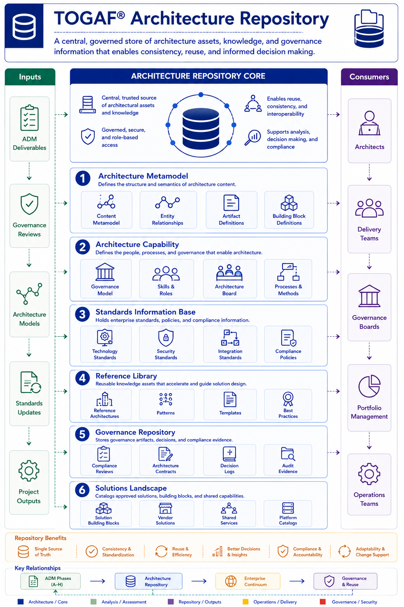 
  <em>TOGAF Architecture Repository</em>
</td>
</tr>
</table>

<table>
<tr>
<td valign="top">

### 17. TOGAF Architecture Deliverables

Explains the formal deliverables produced throughout the TOGAF ADM lifecycle, including architecture definitions, governance artifacts, transition plans, compliance outputs, and stakeholder communication packages.

Note:
“Architecture Definition Deliverables” and “Transition & Migration Deliverables” slightly overlap with existing ADM phase concepts, but here they are framed correctly as outputs/artifacts rather than phases, so the diagram is still valid and useful.

</td>
</tr>
<tr>
<td align="center">
  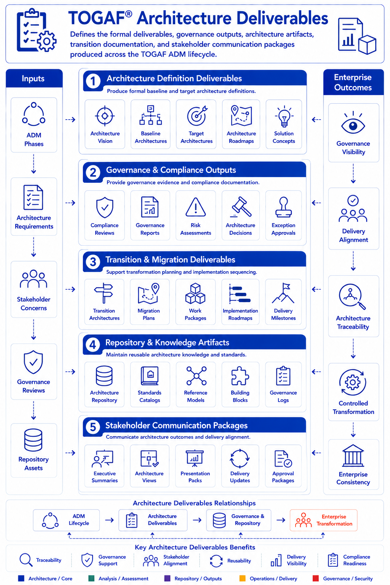 
  <em>TOGAF Architecture Deliverables</em>
</td>
</tr>
</table>

<table>
<tr>
<td valign="top">

### 18. TOGAF Architecture Artifacts

Defines the catalogs, matrices, diagrams, and supporting architectural artifacts used throughout the TOGAF ADM lifecycle to document, analyze, communicate, and govern enterprise architecture.

</td>
</tr>
<tr>
<td align="center">
  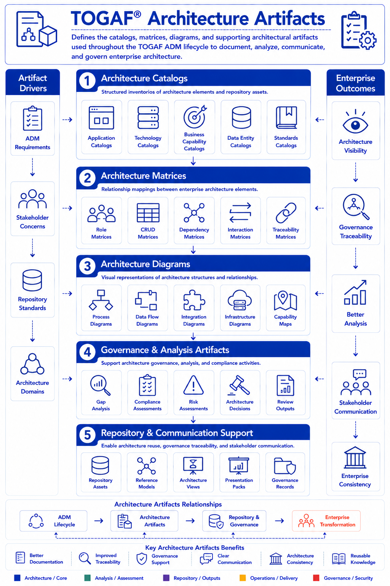 
  <em>TOGAF Architecture Artifacts</em>
</td>
</tr>
</table>

<table>
<tr>
<td valign="top">

### 19. TOGAF Capability-Based Planning

Explains how TOGAF uses capability-based planning to identify, assess, prioritize, and roadmap enterprise capabilities that support strategic transformation and business value realization.

</td>
</tr>
<tr>
<td align="center">
   
  <em>TOGAF Capability-Based Planning</em>
</td>
</tr>
</table>

<table>
<tr>
<td valign="top">

### 20. TOGAF Architecture Metamodel

A visual overview of the TOGAF Architecture Metamodel showing the structural relationships between business, data, application, and technology architecture elements used to maintain consistency, traceability, governance alignment, and enterprise-wide modeling standards.

</td>
</tr>
<tr>
<td align="center">
   
  <em>TOGAF Architecture Metamodel</em>
</td>
</tr>
</table>

<table>
<tr>
<td valign="top">

### 21. TOGAF Architecture Partitioning

A visual overview of TOGAF Architecture Partitioning showing how enterprise architectures are separated across strategic, segment, capability, business unit, and solution levels to support governance, scalability, reuse, and controlled transformation.

</td>
</tr>
<tr>
<td align="center">
   
  <em>TOGAF Architecture Partitioning</em>
</td>
</tr>
</table>

<table>
<tr>
<td valign="top">

### 22. TOGAF Architecture Landscape

A structured view of enterprise architecture assets across strategic, segment, and capability levels, supporting governance, reuse, planning, and architecture evolution.

</td>
</tr>
<tr>
<td align="center">
   
  <em>TOGAF Architecture Landscape</em>
</td>
</tr>
</table>

<table>
<tr>
<td valign="top">

### 23. TOGAF Enterprise Continuum

A visual overview of the TOGAF Enterprise Continuum showing how reusable architecture assets evolve from generic foundation architectures to organization-specific enterprise solutions, enabling standardization, governance alignment, reuse, and architecture consistency across the enterprise.

</td>
</tr>
<tr>
<td align="center">
  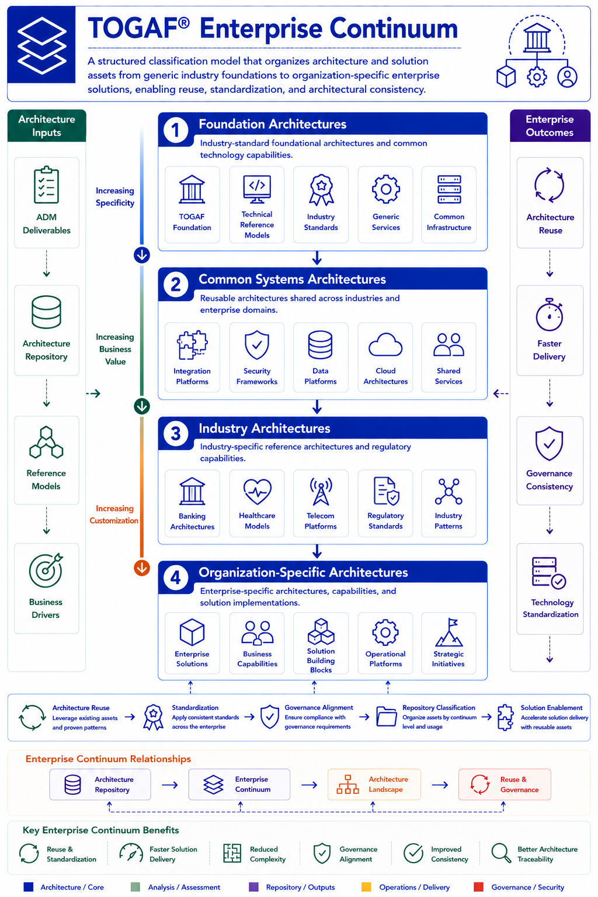 
  <em>TOGAF Enterprise Continuum</em>
</td>
</tr>
</table>

<table>
<tr>
<td valign="top">

### 24. TOGAF Reference Architectures

Reusable architecture models, standards, patterns, and implementation guidance that accelerate solution delivery, improve consistency, and support enterprise governance across the enterprise.

</td>
</tr>
<tr>
<td align="center">
  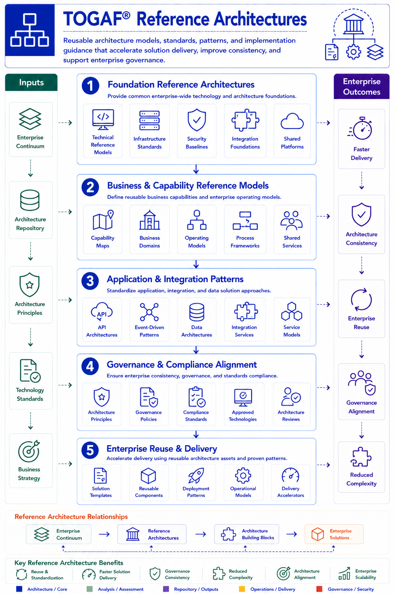 
  <em>TOGAF Reference Architectures</em>
</td>
</tr>
</table>

<table>
<tr>
<td valign="top">

### 25. TOGAF Architecture Building Blocks (ABBs)

A visual overview of TOGAF Architecture Building Blocks (ABBs) showing how reusable logical architecture capabilities, standards, services, and governance models define enterprise architecture intent and guide the realization of Solution Building Blocks and enterprise solutions.

</td>
</tr>
<tr>
<td align="center">
  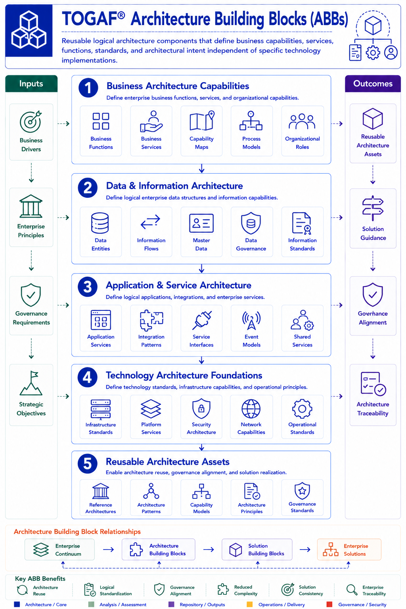 
  <em>TOGAF Architecture Building Blocks (ABBs)</em>
</td>
</tr>
</table>

<table>
<tr>
<td valign="top">

### 26. TOGAF Solution Building Blocks (SBBs)

A visual overview of TOGAF Solution Building Blocks (SBBs) showing how reusable technology components, platforms, integrations, operational services, and governance capabilities implement enterprise architecture solutions and enable standardized, scalable delivery.

</td>
</tr>
<tr>
<td align="center">
  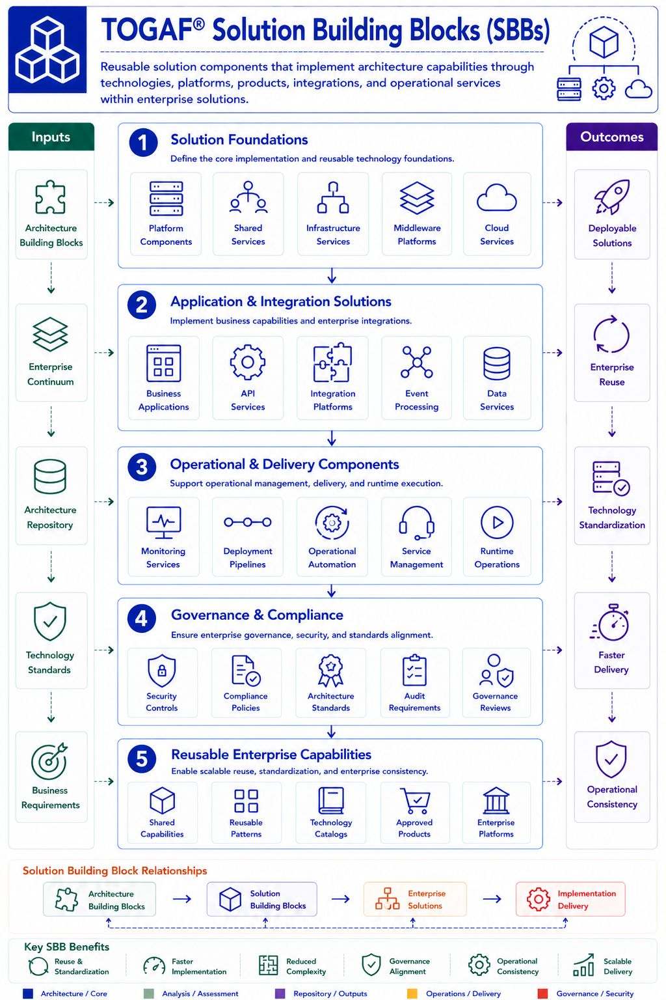 
  <em>TOGAF Solution Building Blocks (SBBs)</em>
</td>
</tr>
</table>

<table>
<tr>
<td valign="top">

### 27. Standards Information Base

A visual overview of the TOGAF Standards Information Base showing approved enterprise standards, technology policies, security controls, compliance requirements, governance lifecycle, and consumers who use standards to support architecture consistency and enterprise compliance.

</td>
</tr>
<tr>
<td align="center">
  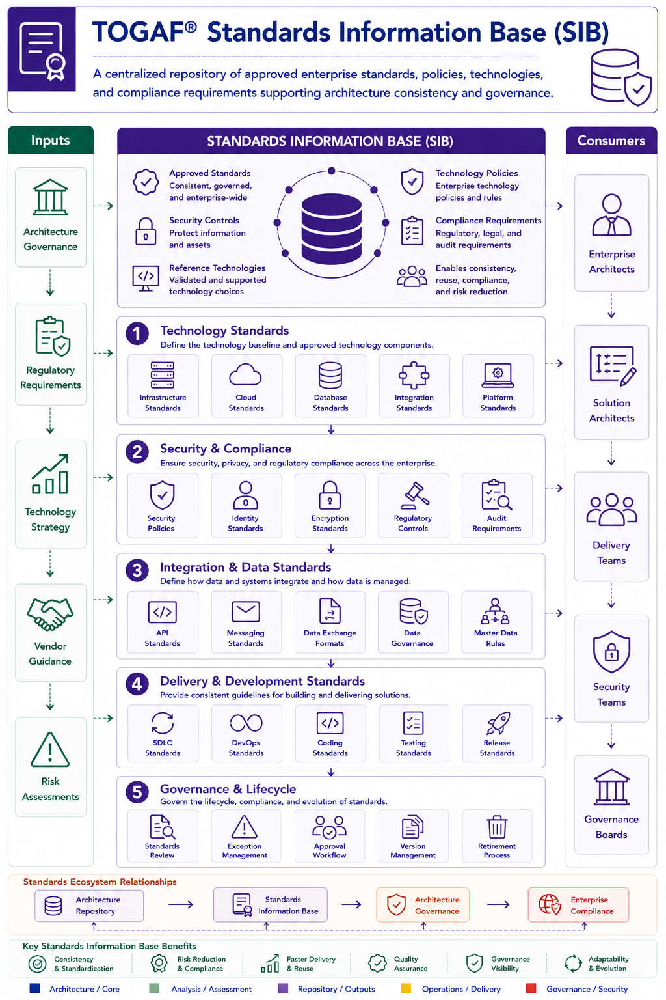 
  <em>Standards Information Base</em>
</td>
</tr>
</table>

<table>
<tr>
<td valign="top">

### 28. TOGAF Governance Log

A visual overview of the TOGAF Governance Log showing architecture decisions, compliance activities, governance oversight, risk and exception management, audit traceability, and continuous governance evolution supporting enterprise accountability and compliance.

</td>
</tr>
<tr>
<td align="center">
  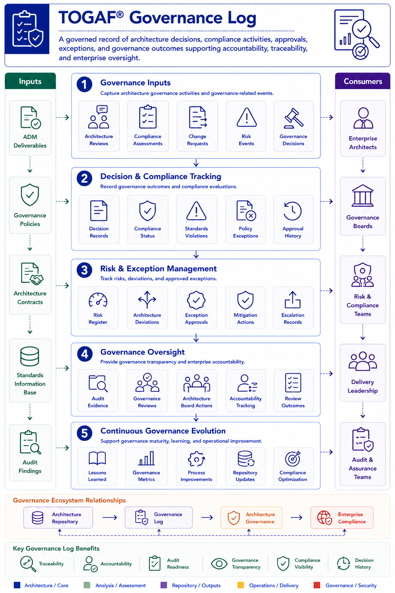 
  <em>TOGAF Governance Log</em>
</td>
</tr>
</table>

<table>
<tr>
<td valign="top">

### 29. TOGAF Architecture Principles

A visual overview of TOGAF Architecture Principles showing how business, data, application, technology, and governance principles guide enterprise decision-making, standards alignment, architecture quality, and consistent solution delivery.

</td>
</tr>
<tr>
<td align="center">
  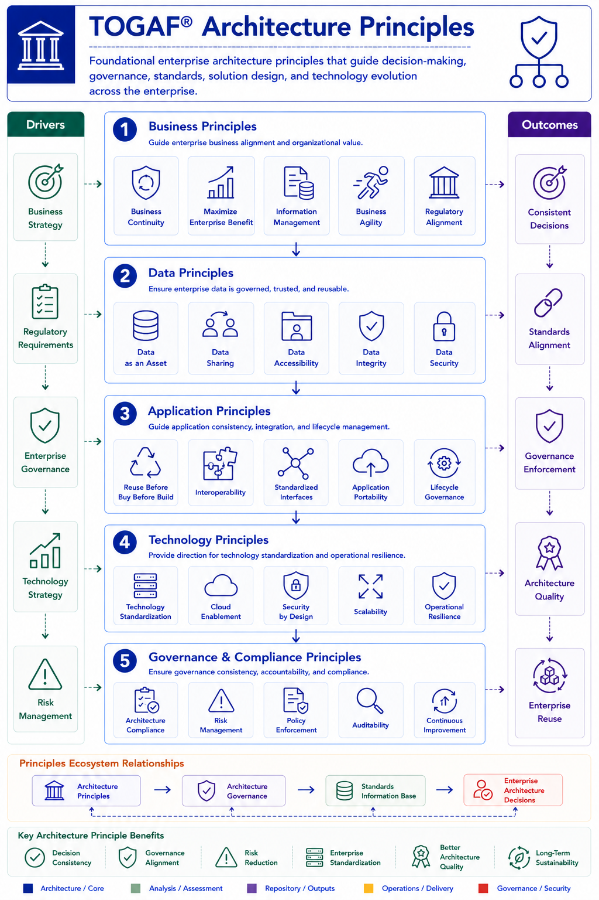 
  <em>TOGAF Architecture Principles</em>
</td>
</tr>
</table>

<table>
<tr>
<td valign="top">

### 30. TOGAF Architecture Capability

A visual overview of TOGAF Architecture Capability showing the governance structures, people, processes, tools, repository support, maturity practices, and continuous improvement mechanisms required to develop, govern, and sustain enterprise architecture across the organization.

</td>
</tr>
<tr>
<td align="center">
   
  <em>TOGAF Architecture Capability</em>
</td>
</tr>
</table>

<table>
<tr>
<td valign="top">

### 31. TOGAF Architecture Contracts

A visual overview of TOGAF Architecture Contracts showing governance agreements, architecture expectations, compliance obligations, responsibilities, delivery alignment, risk and exception management, and implementation accountability across the enterprise.

</td>
</tr>
<tr>
<td align="center">
  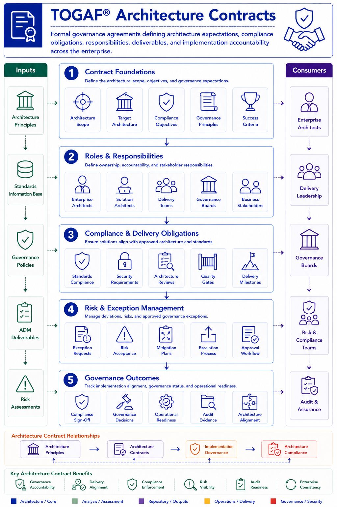 
  <em>TOGAF Architecture Contracts</em>
</td>
</tr>
</table>

<table>
<tr>
<td valign="top">

### 32. TOGAF Architecture Compliance Reviews

A visual overview of TOGAF Architecture Compliance Reviews showing how enterprise solutions are assessed against architecture principles, standards, governance requirements, risks, and compliance obligations to ensure alignment and delivery readiness.

</td>
</tr>
<tr>
<td align="center">
  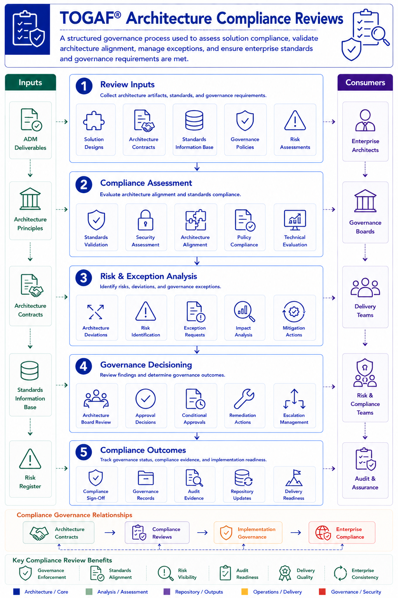 
  <em>TOGAF Architecture Compliance Reviews</em>
</td>
</tr>
</table>

<table>
<tr>
<td valign="top">

### 33. TOGAF Governance Repository

A centralized governance repository that stores architecture decisions, compliance records, policies, audit evidence, approvals, and governance outcomes supporting enterprise accountability, traceability, and regulatory alignment.

</td>
</tr>
<tr>
<td align="center">
  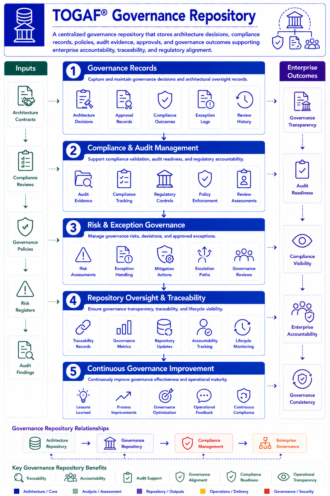 
  <em>TOGAF Governance Repository</em>
</td>
</tr>
</table>

<table>
<tr>
<td valign="top">

### 34. TOGAF Risk Management

A visual overview of TOGAF Risk Management showing how enterprise architecture risks are identified, assessed, governed, mitigated, and continuously monitored across transformation initiatives and ADM activities.

</td>
</tr>
<tr>
<td align="center">
   
  <em>TOGAF Risk Management</em>
</td>
</tr>
</table>

<table>
<tr>
<td valign="top">

### 35. TOGAF Security Architecture Integration

A visual overview of TOGAF Security Architecture Integration showing how security controls, governance, compliance, resilience, and risk management are embedded across business, data, application, and technology architecture domains.

</td>
</tr>
<tr>
<td align="center">
  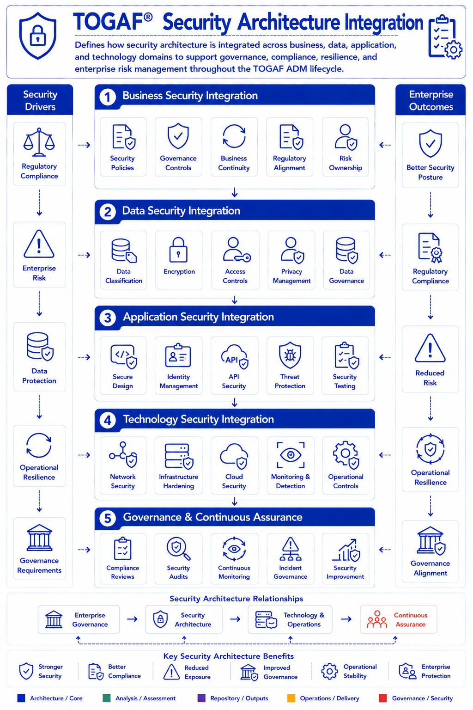 
  <em>TOGAF Security Architecture Integration</em>
</td>
</tr>
</table>

<table>
<tr>
<td valign="top">

### 36. TOGAF Requirements Management

A continuous process that captures, validates, prioritizes, manages, and governs architecture requirements across all ADM phases to ensure alignment with business objectives and solution delivery.

</td>
</tr>
<tr>
<td align="center">
   
  <em>TOGAF Requirements Management</em>
</td>
</tr>
</table>

<table>
<tr>
<td valign="top">

### D. TOGAF Technology Architecture

A layered view of TOGAF Technology Architecture showing infrastructure foundations, platform services, integration capabilities, security architecture, operational resilience, and key technology outputs.

</td>
</tr>
<tr>
<td align="center">
   
  <em>TOGAF Technology Architecture</em>
</td>
</tr>
</table>

<table>
<tr>
<td valign="top">

### E. Opportunities & Solutions

A Phase E diagram illustrating gap analysis, candidate solutions, work packages, transition architectures, and roadmap planning used to move from baseline to target architecture.

</td>
</tr>
<tr>
<td align="center">
   
  <em>Opportunities & Solutions</em>
</td>
</tr>
</table>

<table>
<tr>
<td valign="top">

### F. Migration Planning

A TOGAF Phase F diagram illustrating implementation sequencing, migration planning, dependency management, governance alignment, and realization of the target architecture.

</td>
</tr>
<tr>
<td align="center">
   
  <em>Migration Planning</em>
</td>
</tr>
</table>

<table>
<tr>
<td valign="top">

### G. TOGAF Implementation Governance

A TOGAF Phase G diagram illustrating architecture compliance, governance oversight, change management, implementation support, and realization of approved target architectures.

</td>
</tr>
<tr>
<td align="center">
  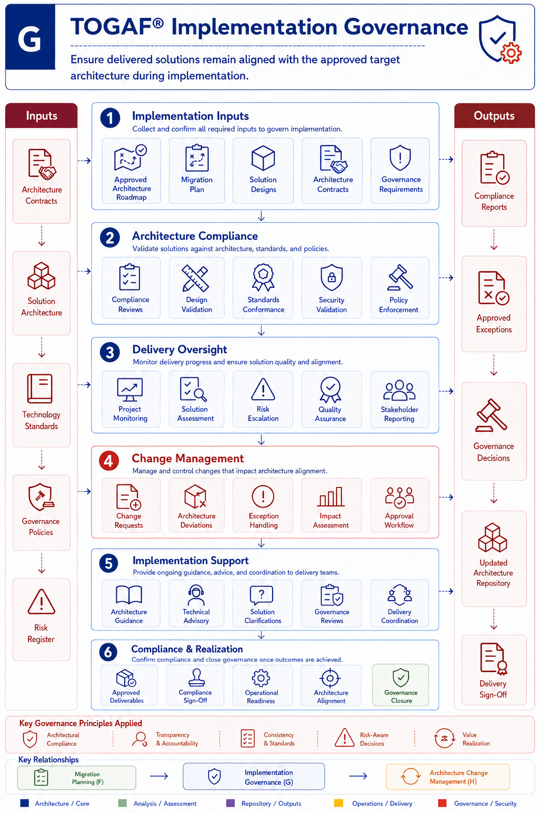 
  <em>TOGAF Implementation Governance</em>
</td>
</tr>
</table>

<table>
<tr>
<td valign="top">

### H. TOGAF Architecture Change Management

A TOGAF Phase H diagram illustrating change assessment, governance decisioning, architecture evolution, continuous improvement, and re-initiation of the ADM lifecycle.

</td>
</tr>
<tr>
<td align="center">
  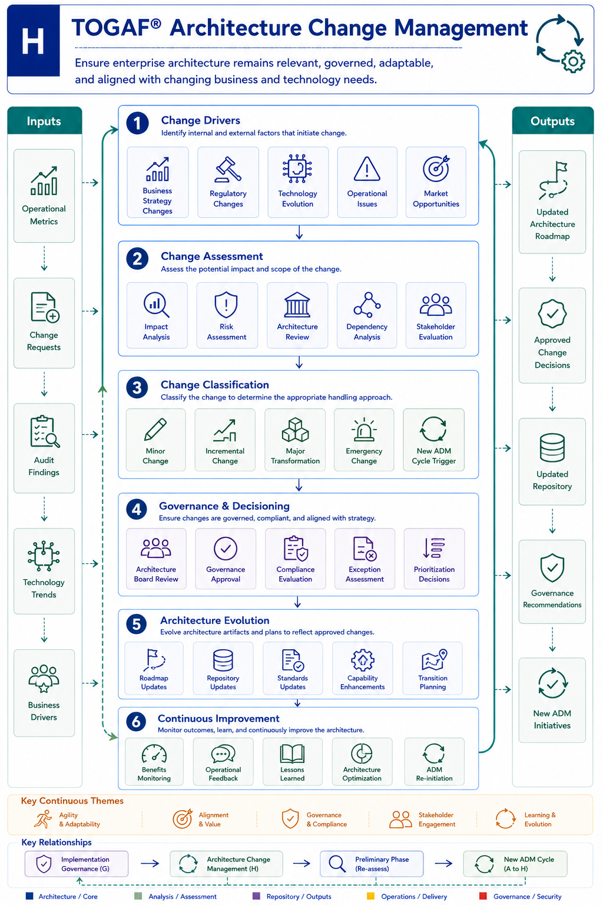 
  <em>TOGAF Architecture Change Management</em>
</td>
</tr>
</table>

## Contributing

See [CONTRIBUTING.md](CONTRIBUTING.md).

## License

This repository is licensed under the [MIT License](./LICENSE).
