# TOGAF Diagrams

A free visual library of TOGAF 10 enterprise architecture diagrams — clear, simplified visuals covering the ADM lifecycle, architecture governance, capability planning, stakeholder management, compliance, risk, and more.

> [!NOTE]
> This is an independent, community-created visual learning resource. It is not affiliated with or endorsed by The Open Group. The diagrams simplify and interpret TOGAF concepts for educational use; consult the official TOGAF documentation for authoritative guidance.

> All diagrams in this repository were created by me and are free to use under the MIT License.
> 
> They are free to use for any purpose, personal or commercial, with no attribution required, though it’s always appreciated .
> 
> If you find them useful, consider leaving a ⭐ it helps others find the library too.

## Repository structure

- `docs/images/`: repository presentation assets for GitHub-facing documentation.
- `docs/diagrams/`: active, published diagram PNG files grouped by domain.
- `archive/`: superseded or historical diagram files.
- `README.md`: repository overview for GitHub.
- `index.html`: GitHub Pages landing page.

## Recommended Learning Path

Click to expand

### 🚀 Foundation
1. **Start here →** [TOGAF ADM Cycle](#2-togaf-adm-cycle) — understand the overall framework before anything else
2. [TOGAF ADM End-to-End Reference Map](#1-togaf-adm-end-to-end-reference-map) — see all phases, inputs, and outputs in detail
3. [TOGAF Architecture Vision](#10-togaf-architecture-vision) — how Phase A sets direction and stakeholder alignment
4. [TOGAF Requirements Management](#40-togaf-requirements-management) — continuous requirements flow across the ADM

### 🏛️ Core Architecture Domains
5. [TOGAF Business Architecture](#13-togaf-business-architecture) — capabilities, value streams, and organisational structure
6. [TOGAF Data Architecture](#14-togaf-data-architecture) — data assets, governance, and lifecycle
7. [TOGAF Application Architecture](#15-togaf-application-architecture) — application structure, integration, and services
8. [TOGAF Technology Architecture](#d-togaf-technology-architecture) — infrastructure, platforms, and operational resilience

### 📐 Structure & Content
9. [Architecture Content Framework](#3-architecture-content-framework) — what gets produced across the ADM
10. [TOGAF Architecture Metamodel](#20-togaf-architecture-metamodel) — structural relationships between architecture elements
11. [TOGAF Architecture Artifacts](#18-togaf-architecture-artifacts) — catalogs, matrices, and diagrams used throughout
12. [TOGAF Architecture Deliverables](#17-togaf-architecture-deliverables) — formal outputs at each ADM phase

### ⚖️ Governance & Control
13. [Architecture Governance Model](#8-architecture-governance-model) — oversight structures and accountability flows
14. [TOGAF Architecture Principles](#30-togaf-architecture-principles) — guiding rules for enterprise decision-making
15. [TOGAF Compliance Assessment](#34-togaf-compliance-assessment) — validating solutions against standards
16. [TOGAF Risk Management](#38-togaf-risk-management) — identifying and mitigating architecture risks

### 🎓 Advanced Enterprise Architecture
17. [Enterprise Continuum & Architecture Repository](#4-enterprise-continuum--architecture-repository) — how architecture assets are classified and reused
18. [TOGAF Capability-Based Planning](#19-togaf-capability-based-planning) — aligning capabilities to strategic transformation
19. [TOGAF Architecture Partitioning](#21-togaf-architecture-partitioning) — scaling governance across the enterprise
20. [TOGAF Architecture Decisions & Traceability](#36-togaf-architecture-decisions--traceability) — tracking rationale across transformation initiatives

## Browse by Category

Click to expand

### ADM & Lifecycle (4)
- [TOGAF ADM End-to-End Reference Map](#1-togaf-adm-end-to-end-reference-map)
- [TOGAF ADM Cycle](#2-togaf-adm-cycle)
- [TOGAF Architecture Vision](#10-togaf-architecture-vision)
- [TOGAF Requirements Management](#40-togaf-requirements-management)

### Architecture Domains (4)
- [TOGAF Business Architecture](#13-togaf-business-architecture)
- [TOGAF Data Architecture](#14-togaf-data-architecture)
- [TOGAF Application Architecture](#15-togaf-application-architecture)
- [TOGAF Technology Architecture](#d-togaf-technology-architecture)

### Content, Metamodel & Structure (6)
- [Architecture Content Framework](#3-architecture-content-framework)
- [TOGAF Architecture Metamodel](#20-togaf-architecture-metamodel)
- [TOGAF Architecture Deliverables](#17-togaf-architecture-deliverables)
- [TOGAF Architecture Artifacts](#18-togaf-architecture-artifacts)
- [TOGAF Architecture Partitioning](#21-togaf-architecture-partitioning)
- [TOGAF Architecture Views & Viewpoints](#11-togaf-architecture-views--viewpoints)

### Repository & Continuum (6)
- [Enterprise Continuum & Architecture Repository](#4-enterprise-continuum--architecture-repository)
- [TOGAF Enterprise Continuum](#24-togaf-enterprise-continuum)
- [TOGAF Architecture Repository](#16-togaf-architecture-repository)
- [TOGAF Architecture Landscape](#23-togaf-architecture-landscape)
- [TOGAF Reference Architectures](#25-togaf-reference-architectures)
- [Standards Information Base](#28-standards-information-base)

### Building Blocks (3)
- [Architecture Building Blocks vs. Solution Building Blocks](#6-architecture-building-blocks-vs-solution-building-blocks)
- [TOGAF Architecture Building Blocks (ABBs)](#26-togaf-architecture-building-blocks-abbs)
- [TOGAF Solution Building Blocks (SBBs)](#27-togaf-solution-building-blocks-sbbs)

### Capability & Planning (5)
- [Capability Assessment & Maturity Models](#5-capability-assessment--maturity-models)
- [TOGAF Capability-Based Planning](#19-togaf-capability-based-planning)
- [TOGAF Architecture Capability](#31-togaf-architecture-capability)
- [Opportunities & Solutions](#e-opportunities--solutions)
- [Migration Planning](#f-migration-planning)

### Stakeholders & Communication (4)
- [Stakeholder Map with Views & Concerns](#7-stakeholder-map-with-views--concerns)
- [TOGAF Stakeholder Management](#12-togaf-stakeholder-management)
- [Business Scenarios](#9-business-scenarios)
- [TOGAF Architecture Communication](#22-togaf-architecture-communication)

### Governance & Compliance (11)
- [Architecture Governance Model](#8-architecture-governance-model)
- [TOGAF Architecture Principles](#30-togaf-architecture-principles)
- [TOGAF Architecture Contracts](#32-togaf-architecture-contracts)
- [TOGAF Architecture Compliance Reviews](#33-togaf-architecture-compliance-reviews)
- [TOGAF Compliance Assessment](#34-togaf-compliance-assessment)
- [TOGAF Governance Log](#29-togaf-governance-log)
- [TOGAF Governance Repository](#35-togaf-governance-repository)
- [TOGAF Architecture Decisions & Traceability](#36-togaf-architecture-decisions--traceability)
- [TOGAF Architecture Change Requests](#37-togaf-architecture-change-requests)
- [TOGAF Architecture Change Management](#h-togaf-architecture-change-management)
- [TOGAF Implementation Governance](#g-togaf-implementation-governance)

### Risk & Security (2)
- [TOGAF Risk Management](#38-togaf-risk-management)
- [TOGAF Security Architecture Integration](#39-togaf-security-architecture-integration)

## Diagrams

### 1. TOGAF ADM End-to-End Reference Map

A full TOGAF ADM end-to-end reference view connecting all Architecture Development Method phases with their key inputs, outputs, and inter-phase relationships in a single swimlane map.

   
  <em>TOGAF ADM End-to-End Reference Map</em>

### 2. TOGAF ADM Cycle

The iterative TOGAF ADM cycle diagram showing all Architecture Development Method phases — Preliminary through A to H — organized around a central Requirements Management process at the core.

   
  <em>TOGAF ADM Cycle — Architecture Development Method phases diagram</em>

<table>
<tr>
<td width="50%" valign="top">

### 3. Architecture Content Framework

A structured metamodel defining the types of architectural work products — deliverables, artifacts, and building blocks — produced across the ADM. The TOGAF Architecture Content Framework diagram illustrates how these work products are categorized and related within the overall enterprise architecture lifecycle.

</td>
<td width="50%" valign="top">

### 4. Enterprise Continuum & Architecture Repository

The TOGAF Enterprise Continuum is a classification system for architecture assets ranging from generic foundation architectures to organization-specific solutions, maintained in the TOGAF Architecture Repository.

</td>
</tr>
<tr>
<td width="50%" align="center">
   
  <em>TOGAF Architecture Content Framework Diagram</em>
</td>
<td width="50%" align="center">
  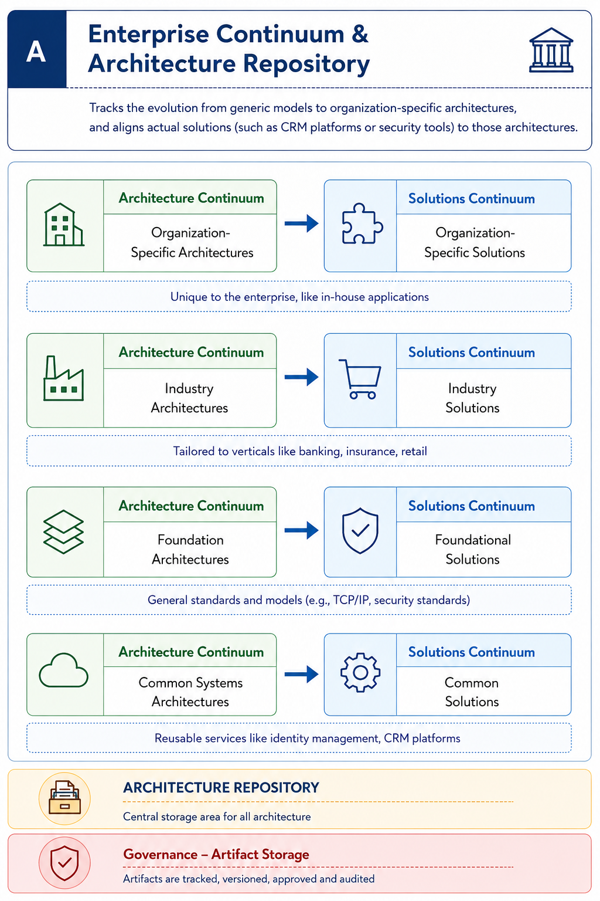 
  <em>TOGAF Enterprise Continuum & Architecture Repository</em>
</td>
</tr>
</table>

<table>
<tr>
<td width="50%" valign="top">

### 5. Capability Assessment & Maturity Models

Use this TOGAF capability assessment diagram to evaluate the maturity of your organization's enterprise architecture capabilities across key dimensions — from initial, ad-hoc practices through to optimising, repeatable governance. Based on the TOGAF capability maturity model, it supports architecture teams and CIOs in benchmarking current-state capability levels and identifying targeted improvement roadmaps aligned with ADM Phase B and Phase E planning.

</td>
<td width="50%" valign="top">

### 6. Architecture Building Blocks vs. Solution Building Blocks

This TOGAF diagram clarifies the distinction between Architecture Building Blocks (ABBs) and Solution Building Blocks (SBBs) — a core concept in the TOGAF content framework and reuse strategy. ABBs define what an architecture needs in vendor-neutral, abstract terms; SBBs deliver those needs as concrete, product-specific components. Use this comparison to guide reuse decisions, procurement strategies, and architecture-to-solution traceability throughout the ADM lifecycle.

</td>
</tr>
<tr>
<td width="50%" align="center">
   
  <em>TOGAF Capability Assessment & Maturity Model — rate enterprise architecture capability levels from initial to optimising</em>
</td>
<td width="50%" align="center" valign="top">
  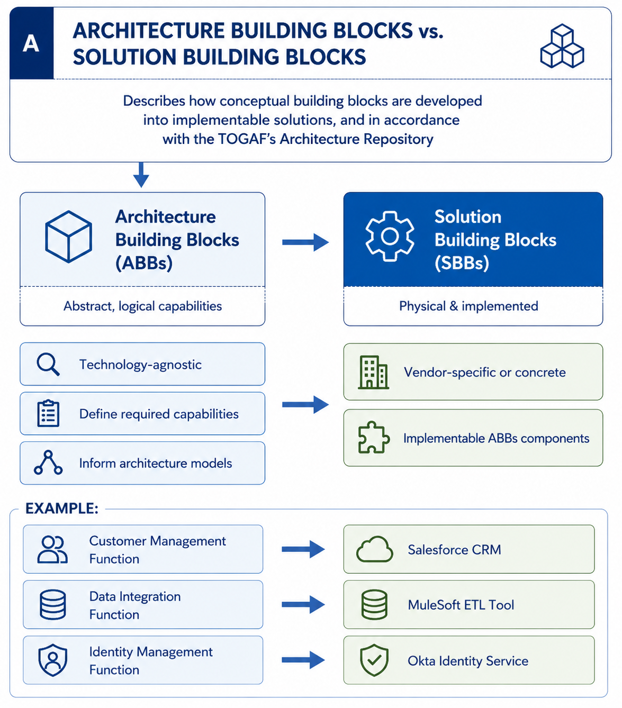 
  <em>TOGAF Architecture Building Blocks (ABBs) vs Solution Building Blocks (SBBs) — abstract vs vendor-specific components</em>
</td>
</tr>
</table>

<table>
<tr>
<td width="50%" valign="top">

### 7. Stakeholder Map with Views & Concerns

This TOGAF stakeholder map shows how key enterprise architecture stakeholders — from business sponsors and CxOs to solution architects and operations teams — are matched to the architecture views and concerns most relevant to their role. Used in Phase A (Architecture Vision) and throughout the ADM, it drives stakeholder engagement planning, ensures the right views are produced for the right audiences, and supports targeted architecture communication.

</td>
<td width="50%" valign="top">

### 8. Architecture Governance Model

An overview of the TOGAF architecture governance framework — covering governance structures, oversight bodies, accountability mechanisms, and compliance controls that ensure architecture quality across the enterprise.

</td>
</tr>
<tr>
<td width="50%" align="center" valign="top">
   
  <em>TOGAF Stakeholder Map with Views & Concerns — matching stakeholder roles to relevant architecture views and concerns</em>
</td>
<td width="50%" align="center" valign="top">
   
  <em>TOGAF Architecture Governance Framework Diagram</em>
</td>
</tr>
</table>

<table>
<tr>
<td valign="top">

### 9. Business Scenarios

In Phase A (Architecture Vision), Business Scenarios are used to identify and articulate the business problem, the environment in which it occurs, the key actors involved, and the desired outcomes. They provide the foundation for validating that the proposed architecture vision genuinely addresses real business needs and stakeholder goals. The diagrams below show two complementary perspectives: the ADM Phase A scenario structure, and a broader view of how business problems, stakeholder interactions, operational processes, and solution requirements support enterprise architecture development and transformation planning.

</td>
</tr>
<tr>
<td align="center">
  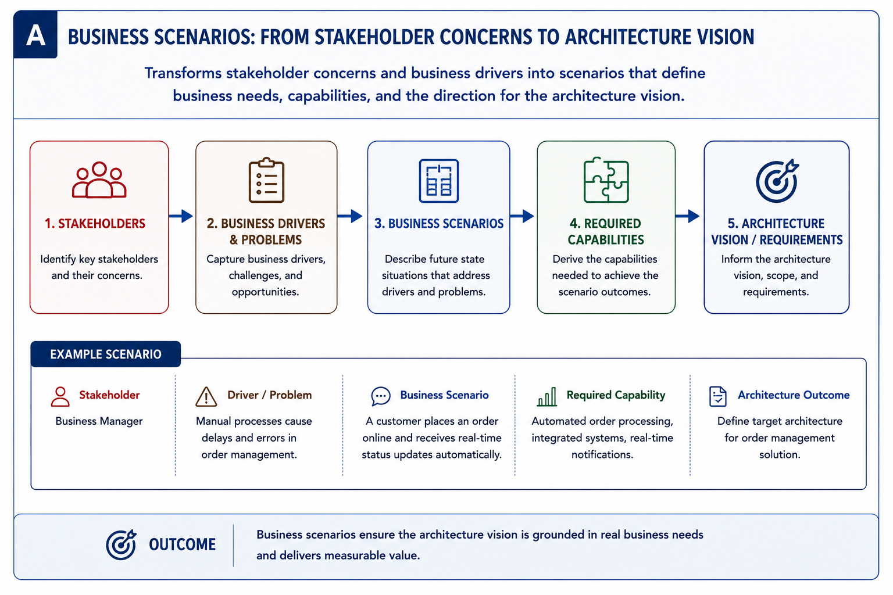 
  <em>Business Scenarios — Phase A ADM View</em>
</td>
</tr>
<tr>
<td align="center">
  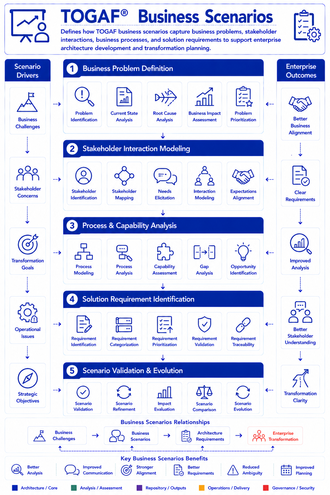 
  <em>Business Scenarios — Enterprise Architecture View</em>
</td>
</tr>
</table>

<table>
<tr>
<td valign="top">

### 10. TOGAF Architecture Vision

Defines the high-level aspirational target architecture, stakeholder alignment, business value, scope, and transformation objectives that guide the enterprise architecture initiative. As the key TOGAF Phase A ADM deliverable, the Architecture Vision diagram sets the direction for all subsequent ADM phases.

</td>
</tr>
<tr>
<td align="center">
  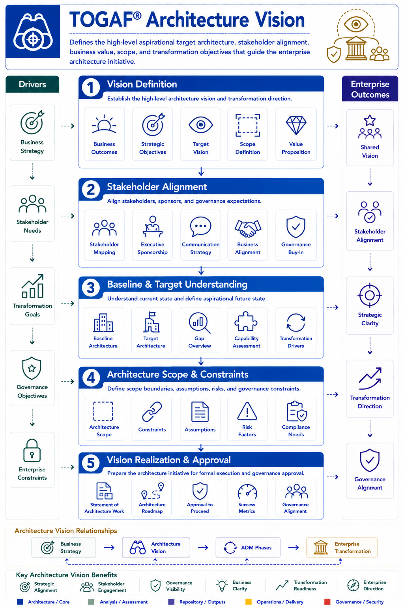 
  <em>TOGAF Architecture Vision</em>
</td>
</tr>
</table>

<table>
<tr>
<td valign="top">

### 11. TOGAF Architecture Views & Viewpoints

This TOGAF architecture views and viewpoints diagram explains how enterprise architecture is communicated to different audiences. In TOGAF, a viewpoint defines the conventions for constructing a view; a view is what a stakeholder actually sees. This diagram shows how stakeholder concerns are mapped to defined viewpoints — business, data, application, technology — and how the resulting views support governance, decision-making, and transformation alignment throughout the ADM lifecycle.

</td>
</tr>
<tr>
<td align="center">
  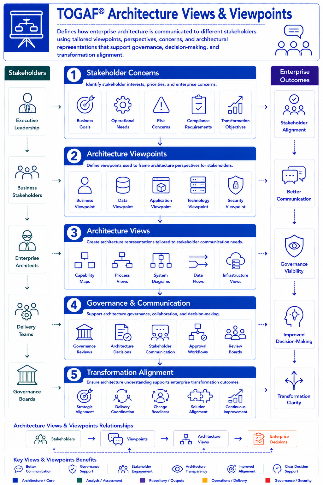 
  <em>TOGAF Architecture Views & Viewpoints — mapping stakeholder concerns to architecture views for governance and communication</em>
</td>
</tr>
</table>

<table>
<tr>
<td valign="top">

### 12. TOGAF Stakeholder Management

This TOGAF stakeholder management diagram shows the structured, iterative process for identifying, classifying, engaging, and governing stakeholders across the enterprise architecture lifecycle. Effective stakeholder management is central to Phase A and runs continuously through the ADM — from understanding stakeholder power and interest through to managing concerns, tailoring communication, and ensuring architecture buy-in at all levels of the organization.

</td>
</tr>
<tr>
<td align="center">
  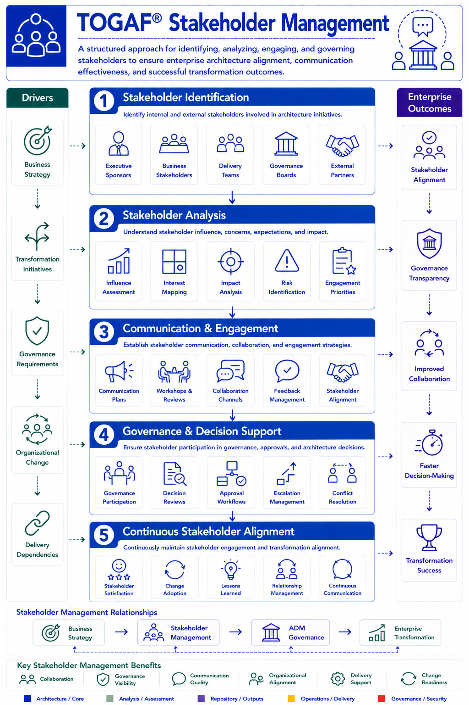 
  <em>TOGAF Stakeholder Management — identifying, engaging, and governing stakeholders across the ADM lifecycle</em>
</td>
</tr>
</table>

<table>
<tr>
<td valign="top">

### 13. TOGAF Business Architecture

Defines the baseline and target business architecture, business capabilities, value streams, organizational structures, and business processes that support enterprise strategy and transformation objectives. This TOGAF Phase B business architecture diagram is a core deliverable of the ADM Business Architecture phase.

</td>
</tr>
<tr>
<td align="center">
  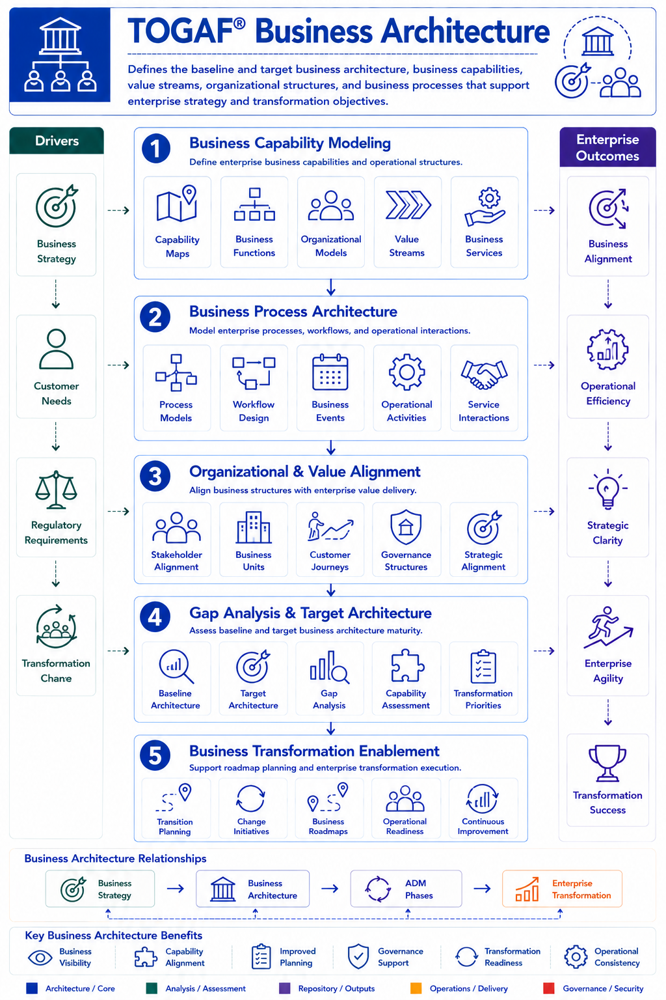 
  <em>TOGAF Business Architecture</em>
</td>
</tr>
</table>

<table>
<tr>
<td valign="top">

### 14. TOGAF Data Architecture

This TOGAF Data Architecture diagram covers Phase C of the ADM, defining the structure, governance, lifecycle, and integration of enterprise data assets. It maps how data entities, logical data models, data flows, and governance policies support business capabilities, analytics platforms, regulatory compliance, and interoperability. Use it to align data strategy with business objectives and to plan baseline-to-target data architecture transitions.

</td>
</tr>
<tr>
<td align="center">
  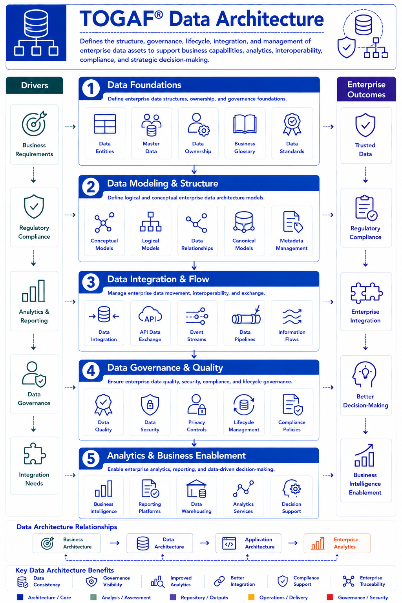 
  <em>TOGAF Data Architecture — Phase C data entities, governance, lifecycle, and integration across the enterprise</em>
</td>
</tr>
</table>

<table>
<tr>
<td valign="top">

### 15. TOGAF Application Architecture

This TOGAF Application Architecture diagram covers Phase C of the ADM, mapping the enterprise application landscape — application components, services, interactions, integration patterns, and governance controls. It shows how application portfolios are structured to deliver business capabilities, support operational processes, and enable digital transformation. Use it to plan application rationalization, service-oriented architecture alignment, and baseline-to-target application transitions.

</td>
</tr>
<tr>
<td align="center">
   
  <em>TOGAF Application Architecture — Phase C application components, services, integration, and governance</em>
</td>
</tr>
</table>

<table>
<tr>
<td valign="top">

### 16. TOGAF Architecture Repository

The TOGAF Architecture Repository is the central store for all architecture-related assets across the enterprise. This diagram shows its six components — Architecture Metamodel, Architecture Capability, Architecture Landscape, Standards Information Base, Reference Library, and Governance Log — and how repository consumers such as architecture teams, governance boards, and project delivery teams interact with them. It is essential for managing architecture reuse, standards compliance, and knowledge retention across the ADM.

</td>
</tr>
<tr>
<td align="center">
   
  <em>TOGAF Architecture Repository — six components including Standards Information Base, Governance Log, and Reference Library</em>
</td>
</tr>
</table>

<table>
<tr>
<td valign="top">

### 17. TOGAF Architecture Deliverables

This TOGAF Architecture Deliverables diagram maps the formal outputs produced at each ADM phase — from Architecture Vision and Architecture Definition Documents through to Transition Plans, Implementation Governance specs, and Architecture Compliance assessments. Unlike artifacts (which are internal working documents), TOGAF deliverables are contractual outputs subject to stakeholder review and sign-off. Use this diagram to understand what must be produced, reviewed, and baselined at each stage of the ADM lifecycle.

</td>
</tr>
<tr>
<td align="center">
   
  <em>TOGAF Architecture Deliverables — formal ADM outputs from Architecture Vision through Transition Plans and Compliance assessments</em>
</td>
</tr>
</table>

<table>
<tr>
<td valign="top">

### 18. TOGAF Architecture Artifacts

This TOGAF Architecture Artifacts diagram organizes the full set of catalogs, matrices, and diagrams used throughout the ADM lifecycle. Catalogs list architecture entities (applications, data entities, technology components); matrices show relationships between them; diagrams visualize structures and flows. Each ADM phase produces a defined set of artifacts as working documents that support analysis, governance, and stakeholder communication — and feed into the formal deliverables.

</td>
</tr>
<tr>
<td align="center">
   
  <em>TOGAF Architecture Artifacts — catalogs, matrices, and diagrams produced across ADM phases for governance and communication</em>
</td>
</tr>
</table>

<table>
<tr>
<td valign="top">

### 19. TOGAF Capability-Based Planning

Explains how TOGAF uses capability-based planning and business capability planning to identify, assess, prioritize, and roadmap enterprise capabilities that support strategic transformation and business value realization.

</td>
</tr>
<tr>
<td align="center">
  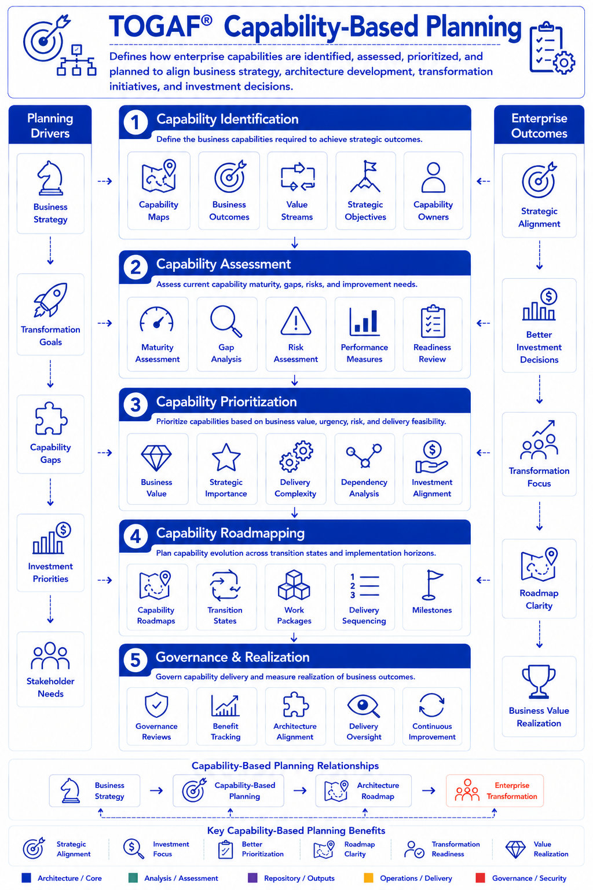 
  <em>TOGAF Capability-Based Planning</em>
</td>
</tr>
</table>

<table>
<tr>
<td valign="top">

### 20. TOGAF Architecture Metamodel

The TOGAF Architecture Metamodel is the formal definition of architecture element types — motivations, actors, business services, data entities, application components, and technology nodes — and the relationships between them that make enterprise architecture coherent and traceable. Applied across Phases B, C, and D of the ADM, it ensures that models produced by different teams share a common vocabulary and structural grammar, enabling cross-domain impact analysis, governance enforcement, and consistent architecture documentation. Enterprise architects, modeling practitioners, and governance boards use this metamodel to align deliverables, validate work products, and maintain a single authoritative view of architecture structure across the enterprise portfolio.

</td>
</tr>
<tr>
<td align="center">
  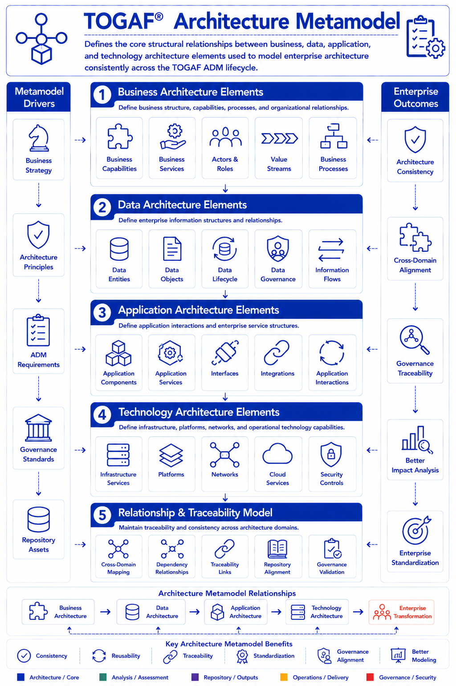 
  <em>TOGAF Architecture Metamodel — element types and cross-domain structural relationships for consistent, traceable enterprise architecture modeling</em>
</td>
</tr>
</table>

<table>
<tr>
<td valign="top">

### 21. TOGAF Architecture Partitioning

A visual overview of TOGAF Architecture Partitioning showing how enterprise architectures are separated across strategic, segment, capability, business unit, and solution levels to support governance, scalability, reuse, and controlled transformation. This enterprise architecture partitioning diagram is essential for managing complexity across large-scale architecture programs.

</td>
</tr>
<tr>
<td align="center">
  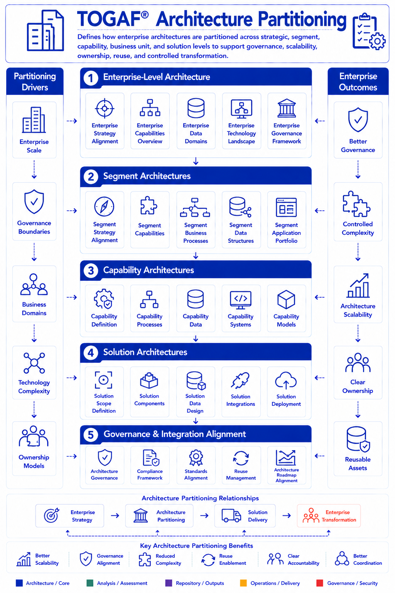 
  <em>TOGAF Architecture Partitioning</em>
</td>
</tr>
</table>

<table>
<tr>
<td valign="top">

### 22. TOGAF Architecture Communication

Architecture communication in TOGAF is the structured practice of ensuring that the right architecture information reaches the right stakeholders — in formats, language, and channels suited to their role, concerns, and decision-making needs. This diagram covers how communication plans are developed in Phase A, maintained throughout the ADM, and tailored for audiences ranging from executive sponsors and governance boards to solution delivery teams and operational managers. It illustrates the feedback loops, reporting cadences, and escalation paths that keep stakeholders aligned with architecture decisions and transformation progress across the full enterprise architecture lifecycle.

</td>
</tr>
<tr>
<td align="center">
  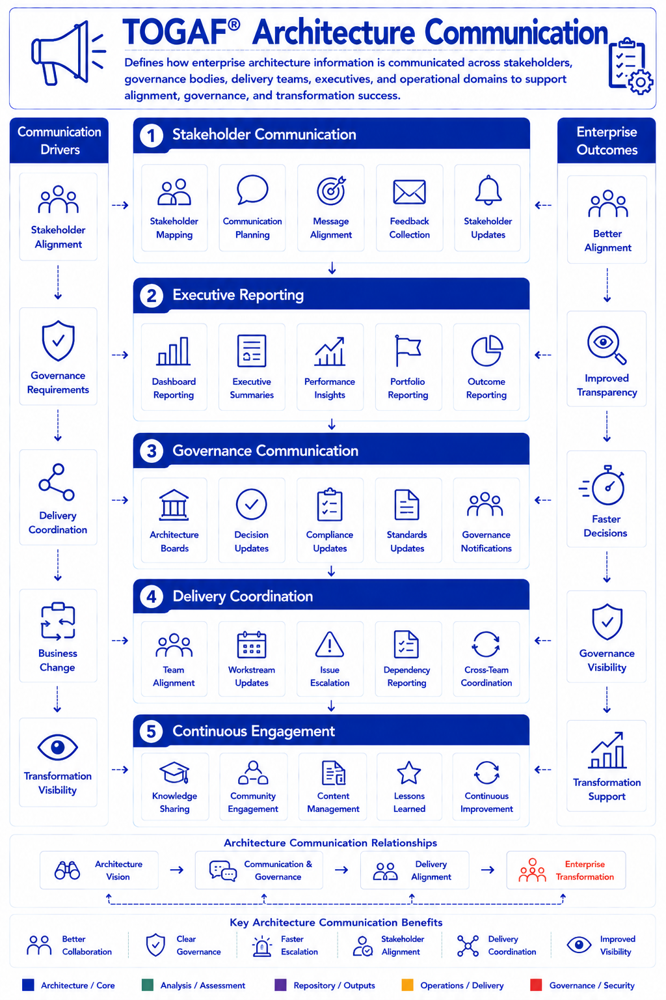 
  <em>TOGAF Architecture Communication — communication plans, stakeholder reporting channels, and governance messaging across all ADM phases</em>
</td>
</tr>
</table>

<table>
<tr>
<td valign="top">

### 23. TOGAF Architecture Landscape

The TOGAF Architecture Landscape is the Architecture Repository component that holds a structured inventory of all enterprise architecture descriptions — organized across three levels: Strategic Architecture (enterprise-wide direction), Segment Architecture (business unit or domain scope), and Capability Architecture (focused, time-boxed solutions). Architecture and governance teams consult the Landscape throughout the ADM — especially in Phase E and Phase F — to identify gaps between baseline and target states, surface reuse opportunities, sequence work packages, and ensure that new initiatives build on approved architecture rather than creating isolated solutions. This diagram shows how the Landscape layers interrelate and feed into planning, governance, and change management processes.

</td>
</tr>
<tr>
<td align="center">
  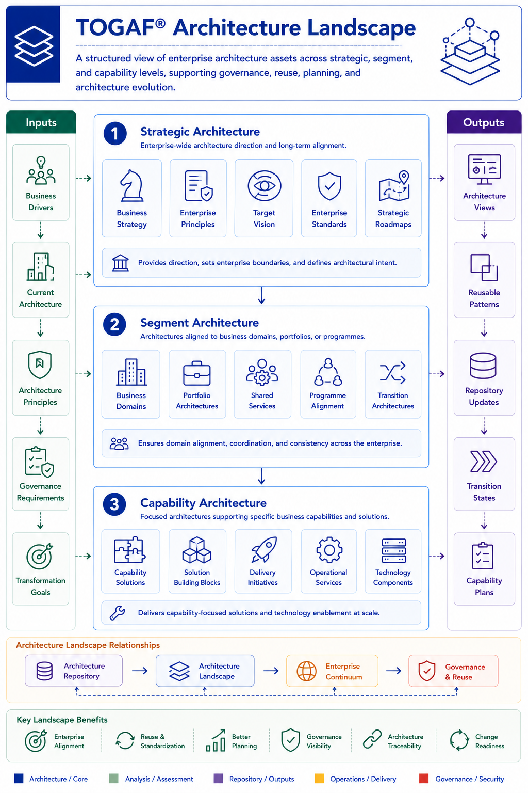 
  <em>TOGAF Architecture Landscape — Strategic, Segment, and Capability Architecture levels supporting gap analysis, reuse, and governance-controlled evolution</em>
</td>
</tr>
</table>

<table>
<tr>
<td valign="top">

### 24. TOGAF Enterprise Continuum

The TOGAF Enterprise Continuum is the classification framework that organizes the full spectrum of reusable architecture assets — from generic Foundation Architectures (TOGAF itself, Zachman, ISO standards) through Common Systems Architectures and Industry Architectures, to organization-specific Enterprise Architectures tailored to a particular company's context. Moving from left to right along the continuum, assets become progressively more specific and contextualized, giving architecture teams a governed pathway from generic best-practice patterns to bespoke enterprise solutions. Used during Phase A and reinforced throughout the ADM, the Enterprise Continuum enables architects to leverage existing investments, accelerate delivery by reusing approved patterns, and avoid duplication across business units or solution domains.

</td>
</tr>
<tr>
<td align="center">
   
  <em>TOGAF Enterprise Continuum — spectrum from Foundation and Common Systems Architectures to organization-specific Industry and Enterprise Architectures</em>
</td>
</tr>
</table>

<table>
<tr>
<td valign="top">

### 25. TOGAF Reference Architectures

TOGAF Reference Architectures are formally validated, reusable architecture templates that encapsulate proven patterns, technology standards, and implementation guidance for specific problem domains — covering areas such as cloud platform architectures, enterprise integration layers, security reference models, and data platform designs. Stored in the Architecture Repository's Reference Library, they give architecture teams a pre-approved, governance-aligned starting point for designing solutions during Phases B, C, D, and E of the ADM, dramatically reducing time-to-design and limiting delivery risk. This diagram shows how reference architectures are sourced, classified, maintained, and applied — and how they interact with Building Blocks, the Standards Information Base, and the broader Enterprise Continuum to support consistent, standards-aligned solution delivery across the enterprise.

</td>
</tr>
<tr>
<td align="center">
   
  <em>TOGAF Reference Architectures — validated reusable architecture patterns and templates from the Architecture Repository Reference Library</em>
</td>
</tr>
</table>

<table>
<tr>
<td valign="top">

### 26. TOGAF Architecture Building Blocks (ABBs)

TOGAF Architecture Building Blocks (ABBs) are the vendor-neutral, capability-level components that define what an architecture must deliver — independent of any specific product or technology. Defined during Phases B, C, and D of the ADM, ABBs capture logical services, governance rules, interface standards, and capability requirements that guide the selection and design of Solution Building Blocks. This diagram shows how ABBs are structured, classified, and linked to governance frameworks, enabling architecture teams to manage reuse, enforce standards, and trace architecture intent through to physical implementation.

</td>
</tr>
<tr>
<td align="center">
   
  <em>TOGAF Architecture Building Blocks (ABBs) — vendor-neutral logical capabilities, interface standards, and governance rules guiding SBB realization across ADM Phases B–D</em>
</td>
</tr>
</table>

<table>
<tr>
<td valign="top">

### 27. TOGAF Solution Building Blocks (SBBs)

TOGAF Solution Building Blocks (SBBs) are the concrete, product-specific components that realize the logical intent defined by Architecture Building Blocks — spanning technology platforms, application packages, integration middleware, security tools, and operational services. Selected and specified during Phase E (Opportunities & Solutions) and Phase F (Migration Planning), SBBs translate abstract architecture requirements into deployable, procurable components. This diagram illustrates how SBBs are categorized, linked to their parent ABBs, governed through the Architecture Repository, and assembled into enterprise solutions that support scalable, standards-aligned delivery.

</td>
</tr>
<tr>
<td align="center">
   
  <em>TOGAF Solution Building Blocks (SBBs) — product-specific components realizing ABB intent, specified during Phase E and Phase F for scalable enterprise delivery</em>
</td>
</tr>
</table>

<table>
<tr>
<td valign="top">

### 28. Standards Information Base

The TOGAF Standards Information Base (SIB) is the Architecture Repository component that catalogs all approved enterprise standards — covering technology policies, security controls, interoperability requirements, compliance obligations, and vendor guidelines — against which architecture solutions are measured. Governance boards, solution architects, and compliance reviewers rely on the SIB throughout the ADM to validate that designs align with enterprise-mandated standards before progressing through phase gates. This diagram shows how standards are organized by domain, managed through a governance lifecycle, and consumed by architecture teams, project delivery, and compliance review processes.

</td>
</tr>
<tr>
<td align="center">
   
  <em>TOGAF Standards Information Base — approved enterprise standards, technology policies, and compliance requirements organized by domain for architecture governance</em>
</td>
</tr>
</table>

<table>
<tr>
<td valign="top">

### 29. TOGAF Governance Log

The TOGAF Governance Log is the Architecture Repository's authoritative record of all governance activity — capturing architecture decisions, compliance review outcomes, approved exceptions, risk assessments, and dispensation requests across the enterprise transformation program. Maintained throughout Phase G (Implementation Governance) and Phase H (Architecture Change Management), it provides the audit trail that governance boards, risk managers, and compliance teams need to demonstrate accountability and regulatory alignment. This diagram shows how governance records are structured, linked to decisions and risks, and continuously updated to reflect the evolving governance posture of the enterprise.

</td>
</tr>
<tr>
<td align="center">
   
  <em>TOGAF Governance Log — decisions, compliance records, exceptions, and audit traceability maintained across Phase G and Phase H</em>
</td>
</tr>
</table>

<table>
<tr>
<td valign="top">

### 30. TOGAF Architecture Principles

TOGAF Architecture Principles are the fundamental rules and guidelines that govern the enterprise's approach to acquiring, deploying, and managing IT — covering business, data, application, technology, and governance domains. Established during the Preliminary Phase and applied throughout the ADM, they provide the normative foundation against which all architecture decisions and compliance reviews are assessed. This diagram shows how principles are structured with statement, rationale, and implications, and how they cascade from strategic business intent through to technology standards, ensuring consistent, principle-led decision-making across the enterprise.

</td>
</tr>
<tr>
<td align="center">
  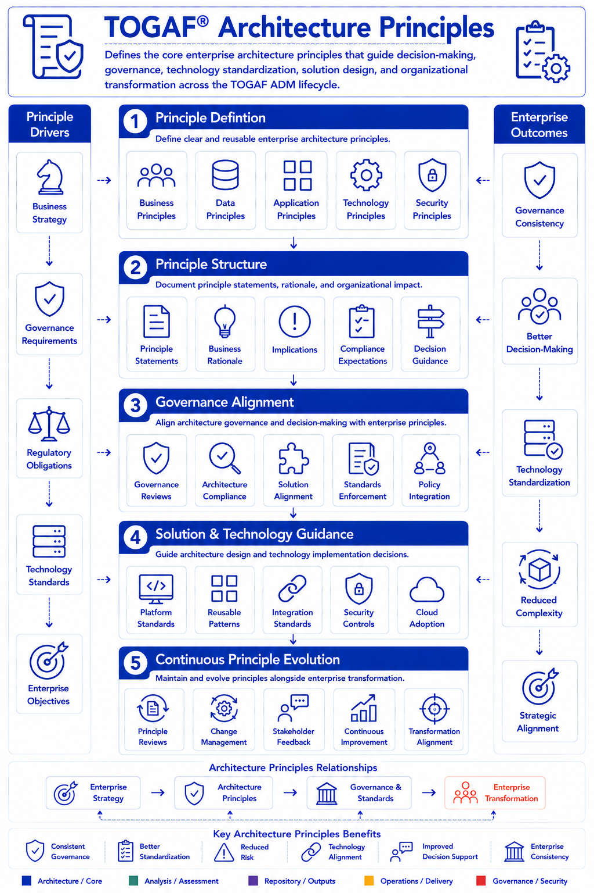 
  <em>TOGAF Architecture Principles — business, data, application, and technology principles with statement, rationale, and implications for enterprise governance</em>
</td>
</tr>
</table>

<table>
<tr>
<td valign="top">

### 31. TOGAF Architecture Capability

TOGAF Architecture Capability defines the organizational structures, skills, processes, tools, and governance mechanisms that an enterprise needs to establish, operate, and continuously improve its enterprise architecture practice. Developed during the Preliminary Phase and refined as the ADM matures, architecture capability covers roles such as the Architecture Board and Chief Architect, supporting tooling and repository infrastructure, capability maturity assessment, and the feedback loops that drive ongoing practice improvement. This diagram shows how the people, process, and technology dimensions of architecture capability combine to create a sustainable, governed EA function that scales with the enterprise.

</td>
</tr>
<tr>
<td align="center">
  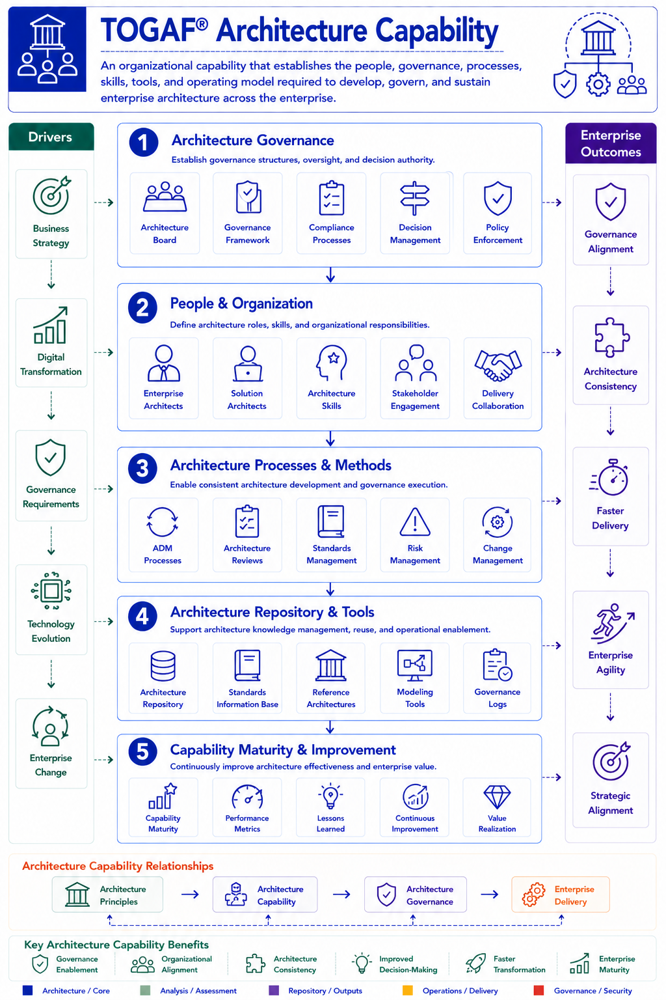 
  <em>TOGAF Architecture Capability — people, processes, tools, and governance structures for a sustainable enterprise architecture practice</em>
</td>
</tr>
</table>

<table>
<tr>
<td valign="top">

### 32. TOGAF Architecture Contracts

TOGAF Architecture Contracts are formal governance agreements between the architecture function and project delivery teams that define mutual expectations, compliance obligations, architecture standards to be met, and escalation procedures for managing exceptions. Created and enforced during Phase G (Implementation Governance), they give the Architecture Board a structured mechanism for maintaining oversight of solution delivery without micromanaging implementation. This diagram shows the anatomy of an architecture contract — covering scope, responsibilities, acceptance criteria, risk and exception management, and the sign-off process — and how contracts link architecture intent to accountable, governed delivery outcomes.

</td>
</tr>
<tr>
<td align="center">
   
  <em>TOGAF Architecture Contracts — governance agreements defining compliance obligations, responsibilities, and acceptance criteria for Phase G implementation oversight</em>
</td>
</tr>
</table>

<table>
<tr>
<td valign="top">

### 33. TOGAF Architecture Compliance Reviews

TOGAF Architecture Compliance Reviews are the formal Phase G governance checkpoints at which solution implementations are assessed against the approved architecture — evaluating adherence to architecture principles, Standards Information Base requirements, security controls, risk thresholds, and delivery obligations. Conducted by the Architecture Board with inputs from compliance checklists and the Governance Log, these reviews determine whether a project can proceed, requires remediation, or needs a formal dispensation. This diagram shows the review workflow — from trigger through assessment, finding classification, and governance decision — and how compliance outcomes feed back into the Governance Log and Architecture Repository.

</td>
</tr>
<tr>
<td align="center">
   
  <em>TOGAF Architecture Compliance Reviews — Phase G governance checkpoints assessing solution implementations against principles, standards, and risk thresholds</em>
</td>
</tr>
</table>

<table>
<tr>
<td valign="top">

### 34. TOGAF Compliance Assessment

TOGAF Compliance Assessment is the structured process used to measure how well a project or solution conforms to the enterprise architecture — evaluating it against approved standards, architecture principles, risk tolerance levels, and governance obligations. Performed during Phase G and tied to Architecture Compliance Reviews, it produces a scored or rated compliance profile that governance boards use to make pass, remediate, or waiver decisions. This diagram illustrates the full assessment lifecycle — from compliance criteria definition through evidence collection, rating, governance review, and outcome recording — supporting accountable, data-driven governance of enterprise transformation programs.

</td>
</tr>
<tr>
<td align="center">
  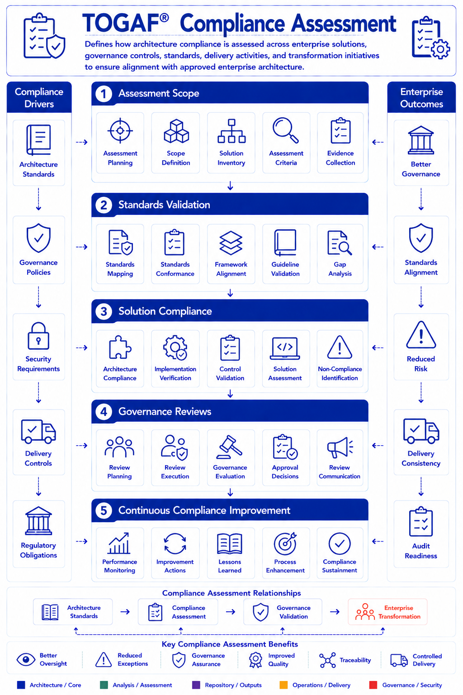 
  <em>TOGAF Compliance Assessment — structured process for measuring solution conformance against architecture standards, principles, and governance obligations in Phase G</em>
</td>
</tr>
</table>

<table>
<tr>
<td valign="top">

### 35. TOGAF Governance Repository

The TOGAF Governance Repository is the centralized store within the Architecture Repository that holds all governance-related records — including architecture decisions, compliance review outcomes, approved waivers, policy statements, audit evidence, risk registers, and governance board approvals. It is the single source of truth for demonstrating that enterprise architecture decisions were made in accordance with approved processes, and it supports regulatory compliance, internal audit, and continuous governance improvement across the ADM lifecycle. This diagram shows the structure and content of the Governance Repository, the governance artifacts it holds, and how it connects to the Governance Log, Architecture Board, and compliance review processes.

</td>
</tr>
<tr>
<td align="center">
   
  <em>TOGAF Governance Repository — centralized store of decisions, compliance records, waivers, and audit evidence supporting enterprise accountability and regulatory alignment</em>
</td>
</tr>
</table>

<table>
<tr>
<td valign="top">

### 36. TOGAF Architecture Decisions & Traceability

Architecture decision management is one of the most critical — and most commonly neglected — governance disciplines in enterprise architecture. In TOGAF, every significant architecture decision must be recorded with its context, alternatives considered, rationale, implications, and approval authority, then linked to the architecture elements, principles, and delivery outcomes it affects. This diagram shows how architecture decisions are structured, stored in the Governance Repository, and traced through to requirements, building blocks, compliance reviews, and implementation work packages — giving governance boards and audit functions a clear chain of accountability from architectural intent to delivered outcomes across the full ADM lifecycle.

</td>
</tr>
<tr>
<td align="center">
  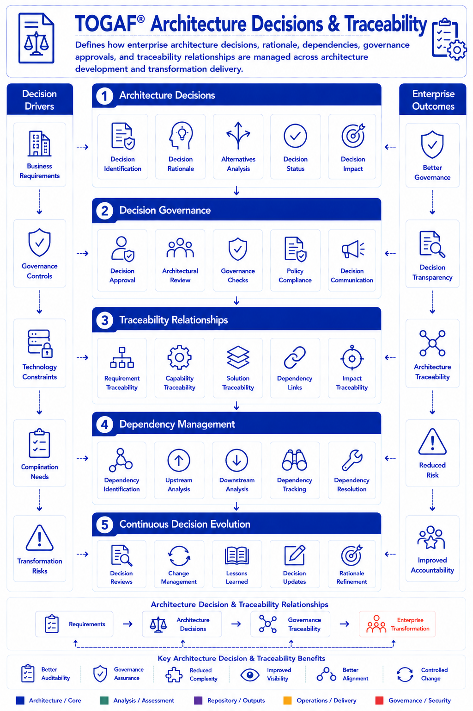 
  <em>TOGAF Architecture Decisions & Traceability — decision records with rationale, approval authority, and traceability links across the ADM governance chain</em>
</td>
</tr>
</table>

<table>
<tr>
<td valign="top">

### 37. TOGAF Architecture Change Requests

TOGAF Architecture Change Requests (ACRs) are the formal mechanism by which stakeholders, project teams, and governance boards trigger controlled updates to the approved architecture during Phase H (Architecture Change Management). Change requests can be driven by business strategy shifts, technology changes, compliance requirements, or delivery-phase learnings — and each must be assessed for architectural impact, risk, cost, and governance implications before approval. This diagram maps the full change request lifecycle — from submission and impact analysis through governance review, decision, and implementation handoff — showing how architecture change is managed in a controlled, traceable way that protects the integrity of the enterprise architecture baseline.

</td>
</tr>
<tr>
<td align="center">
  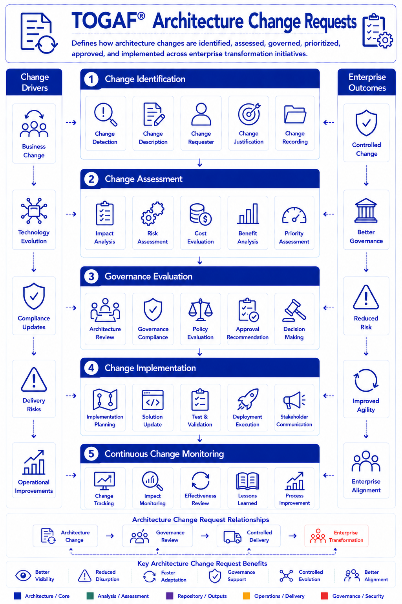 
  <em>TOGAF Architecture Change Requests — Phase H change request lifecycle from submission through impact assessment, governance review, and approved implementation</em>
</td>
</tr>
</table>

<table>
<tr>
<td valign="top">

### 38. TOGAF Risk Management

Enterprise architecture risk management in TOGAF is a continuous, governance-embedded discipline that runs across all ADM phases — identifying, classifying, assessing, and mitigating risks that could prevent the enterprise from achieving its target architecture or transformation objectives. Risk types include initial risks (identified early in the ADM), residual risks (remaining after mitigation), and architecture risks specific to technology, integration, security, and operational domains. This diagram shows how risks are catalogued, rated for likelihood and impact, assigned ownership, linked to mitigation actions and governance decisions, and tracked through the Governance Log to provide continuous risk visibility for Architecture Boards and enterprise risk managers.

</td>
</tr>
<tr>
<td align="center">
  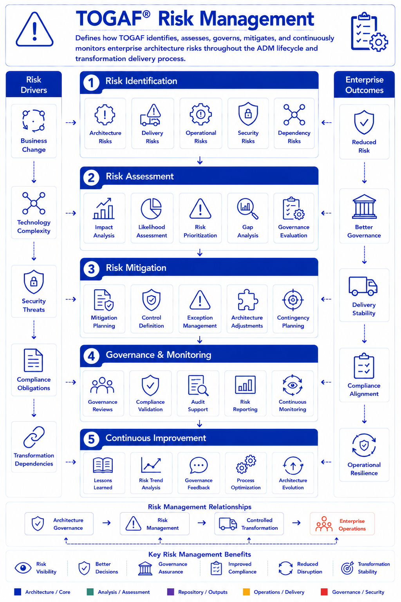 
  <em>TOGAF Risk Management — continuous identification, assessment, mitigation, and governance of architecture risks across all ADM phases</em>
</td>
</tr>
</table>

<table>
<tr>
<td valign="top">

### 39. TOGAF Security Architecture Integration

Security architecture in TOGAF is not a separate domain — it is a cross-cutting concern that must be integrated into every architecture layer from Phase B (Business Architecture) through Phase D (Technology Architecture) and enforced during Phase G (Implementation Governance). This diagram shows how security controls, identity and access management, data protection policies, application security patterns, infrastructure hardening, and resilience requirements are woven into each architecture domain, governed through the Standards Information Base, and validated during compliance reviews. Enterprise architects, security architects, and risk teams use this view to ensure that security is built into architecture by design rather than bolted on after delivery.

</td>
</tr>
<tr>
<td align="center">
   
  <em>TOGAF Security Architecture Integration — cross-cutting security controls, data protection, and resilience requirements embedded across all architecture domains</em>
</td>
</tr>
</table>

<table>
<tr>
<td valign="top">

### 40. TOGAF Requirements Management

The TOGAF ADM Architecture Requirements Management process is continuous and shown at the core of the ADM cycle — it captures, validates, prioritizes, manages, and governs architecture requirements across all ADM phases to ensure alignment with business objectives and solution delivery.

</td>
</tr>
<tr>
<td align="center">
  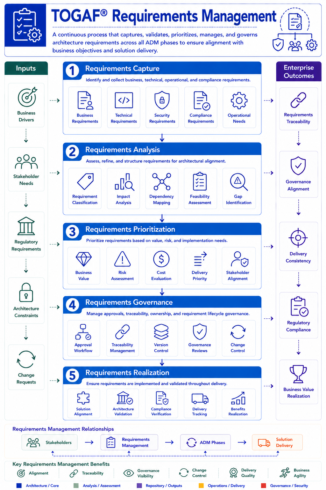 
  <em>TOGAF Requirements Management</em>
</td>
</tr>
</table>

<table>
<tr>
<td valign="top">

### D. TOGAF Technology Architecture

TOGAF Phase D Technology Architecture defines the logical and physical technology landscape that underpins the target enterprise — covering infrastructure platforms, cloud and on-premises hosting models, integration middleware, security architecture, network topology, and operational resilience patterns. As the fourth and final architecture domain defined in the ADM, it translates the application, data, and business architectures into the technology building blocks and platform standards that solution teams actually build on. This diagram presents a layered view of the Technology Architecture — from infrastructure foundations through platform services, integration capabilities, and security controls — along with the key ADM Phase D outputs that governance boards use to validate technology direction and standards alignment.

</td>
</tr>
<tr>
<td align="center">
  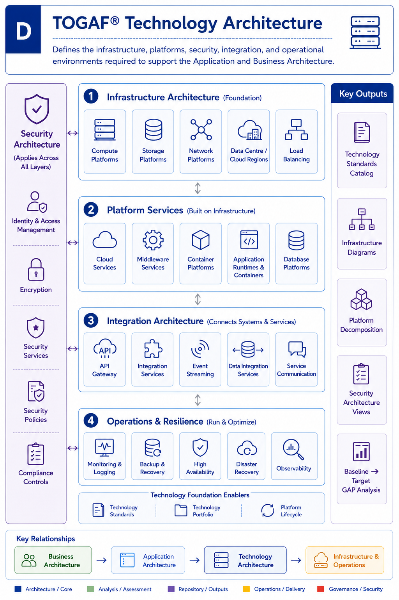 
  <em>TOGAF Technology Architecture — Phase D layered view of infrastructure, platforms, integration, and security underpinning the enterprise target state</em>
</td>
</tr>
</table>

<table>
<tr>
<td valign="top">

### E. Opportunities & Solutions

TOGAF Phase E (Opportunities & Solutions) is where architecture thinking transitions into delivery planning — performing gap analysis between the baseline and target architectures, identifying candidate solutions and work packages, defining transition architectures, and producing the initial implementation roadmap. It is the first ADM phase that explicitly addresses delivery feasibility, integration dependencies, and make-versus-buy decisions. This diagram illustrates the key Phase E activities and outputs — including solution options assessment, work package definitions, transition architecture sequencing, and the linkages to Phase F migration planning — that enable architecture teams to turn approved target architectures into governed, actionable transformation plans.

</td>
</tr>
<tr>
<td align="center">
  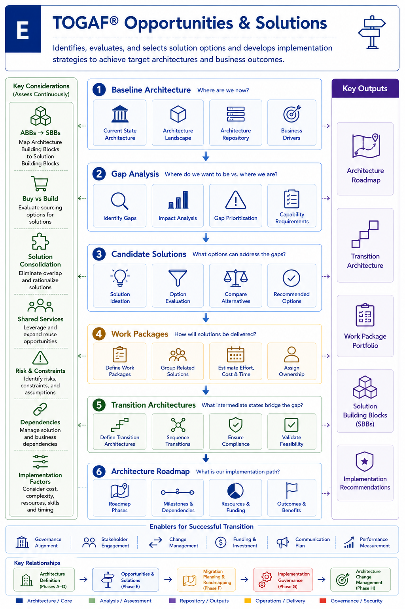 
  <em>TOGAF Opportunities & Solutions — Phase E gap analysis, candidate solutions, work packages, and transition architecture roadmap</em>
</td>
</tr>
</table>

<table>
<tr>
<td valign="top">

### F. Migration Planning

TOGAF Phase F (Migration Planning) takes the work packages and transition architectures defined in Phase E and translates them into a finalized, governed implementation and migration plan — with detailed sequencing, resource allocation, dependency management, risk mitigation, and governance checkpoints. It coordinates inputs from business, IT, and portfolio management to ensure that the migration path is realistic, funded, and aligned with enterprise strategy. This diagram shows the Phase F planning outputs — including the prioritized migration plan, updated Architecture Roadmap, and transition architecture schedule — and how they feed governance approval processes and Phase G implementation oversight.

</td>
</tr>
<tr>
<td align="center">
  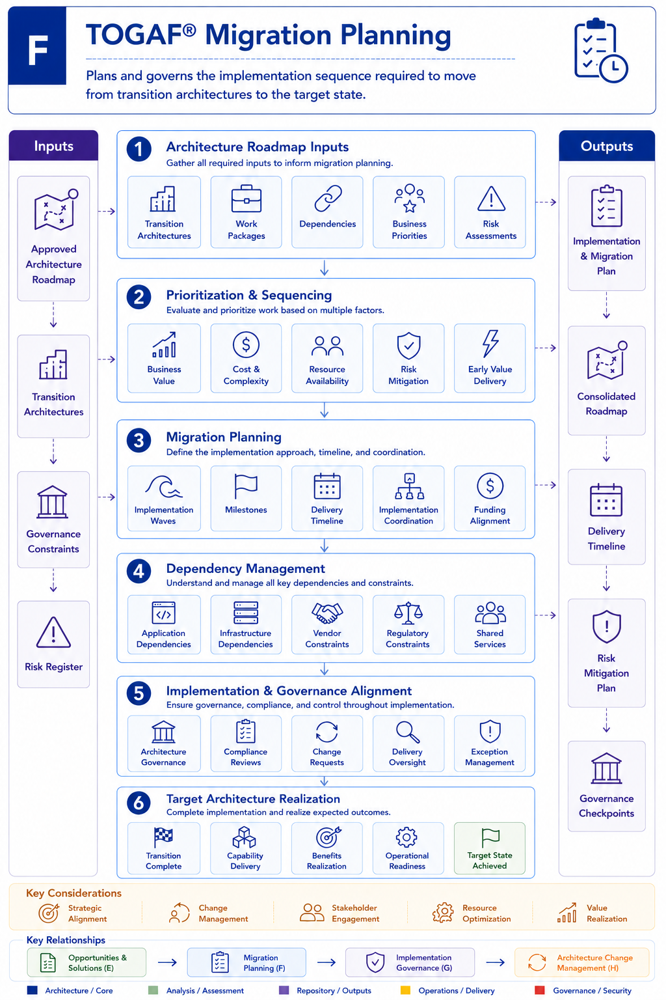 
  <em>TOGAF Migration Planning — Phase F implementation sequencing, dependency management, and governance-aligned Architecture Roadmap</em>
</td>
</tr>
</table>

<table>
<tr>
<td valign="top">

### G. TOGAF Implementation Governance

TOGAF Phase G (Implementation Governance) is the ADM phase that ensures projects implementing the approved architecture do so in compliance with architecture standards, contracts, and governance obligations. The Architecture Board monitors delivery progress, conducts Architecture Compliance Reviews, issues dispensations where justified, and maintains the Governance Log throughout Phase G. This diagram illustrates the key Phase G governance activities — from establishing architecture contracts and compliance criteria through monitoring, exception handling, and post-implementation review — showing how governance oversight bridges approved architecture intent and the reality of enterprise solution delivery.

</td>
</tr>
<tr>
<td align="center">
   
  <em>TOGAF Implementation Governance — Phase G architecture compliance reviews, contracts, exception handling, and Governance Log maintenance</em>
</td>
</tr>
</table>

<table>
<tr>
<td valign="top">

### H. TOGAF Architecture Change Management

TOGAF Phase H (Architecture Change Management) is the continuous monitoring and governance phase that follows implementation — scanning the business and technology environment for changes that may require the approved architecture to evolve, assessing the impact of those changes, processing Architecture Change Requests, and deciding whether to trigger a new ADM cycle. It ensures the enterprise architecture stays aligned with business strategy and technology landscape shifts rather than becoming a static, outdated artefact. This diagram shows the Phase H monitoring inputs, change classification criteria, governance decision pathways, and the triggers that initiate partial or full ADM re-initiation to keep the enterprise architecture current, relevant, and governed.

</td>
</tr>
<tr>
<td align="center">
   
  <em>TOGAF Architecture Change Management — Phase H monitoring, change classification, governance decisions, and ADM re-initiation triggers</em>
</td>
</tr>
</table>

## Contributing

See [CONTRIBUTING.md](CONTRIBUTING.md).

## License

This repository is licensed under the [MIT License](./LICENSE).
